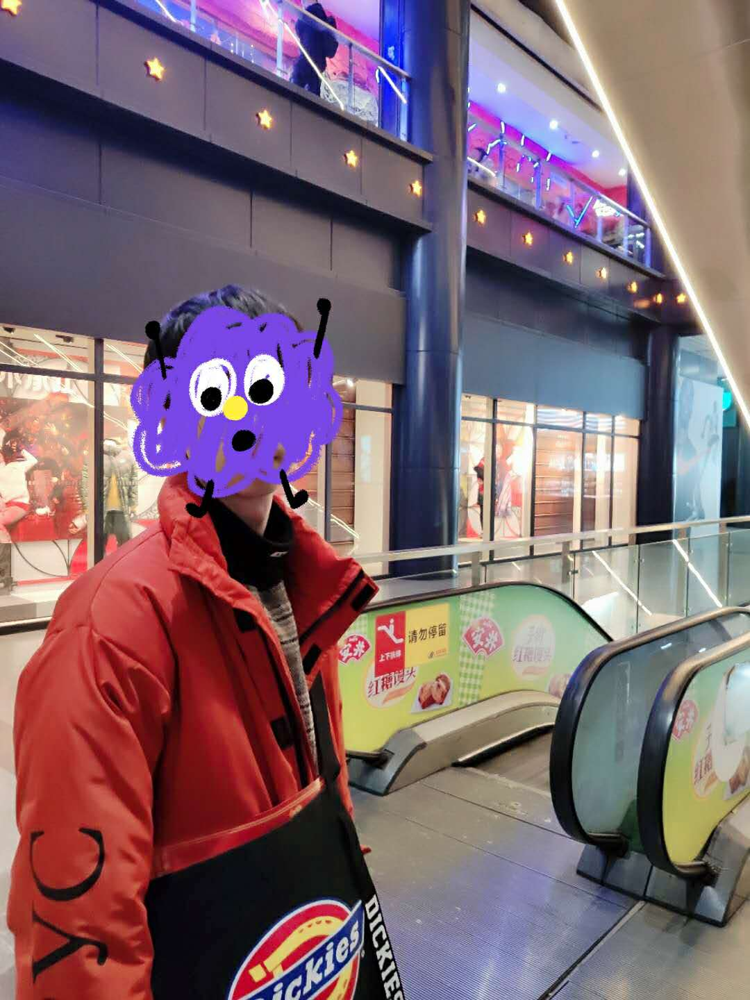

# 回首2019

2019的最后一天开始写自己的第一篇博客，emmm。从来没有写博客的习惯，也就自己懒吧，但是想想偶尔记录一下自己也还不错。

今年终于可以说是走出了学校，离开了那个依赖了很久的IT一点通，这个才十多平方的工作室真的是承载了自己好多回忆。从大一开始玩ACM，屡屡失败后，终于搞不下去了，最后终于在IT混下去了。

去年的现在差不多选好自己的方向吧。选择前端？具体原因我也不知道为啥，应该是PHP学恶心了？或者不想走老师给我安排好的路？但是半年来，我越来越庆幸自己的选择。

好了，有点牛头不对马嘴，语文太烂，就不逼逼了。 最后祝大家新年快乐！！！