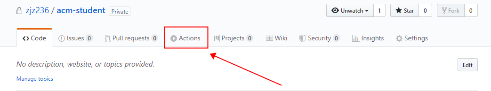
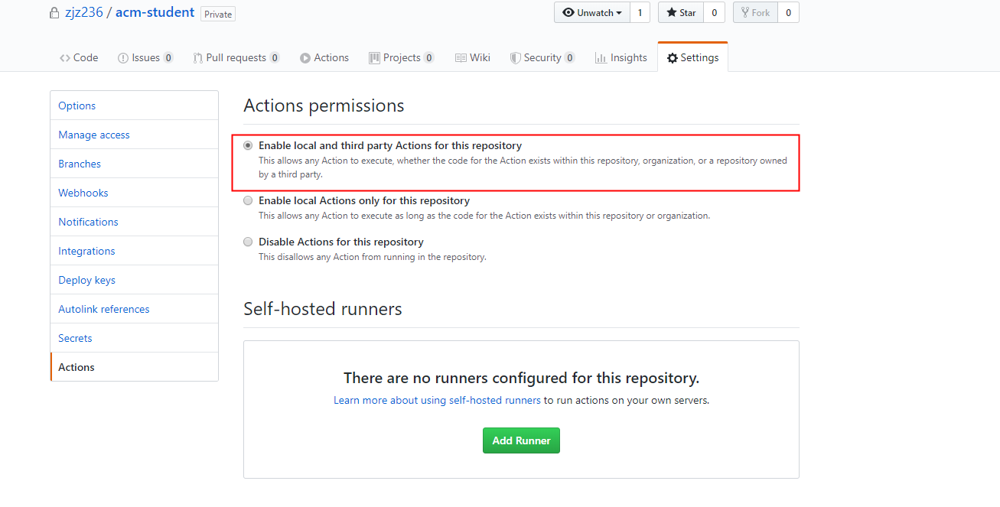
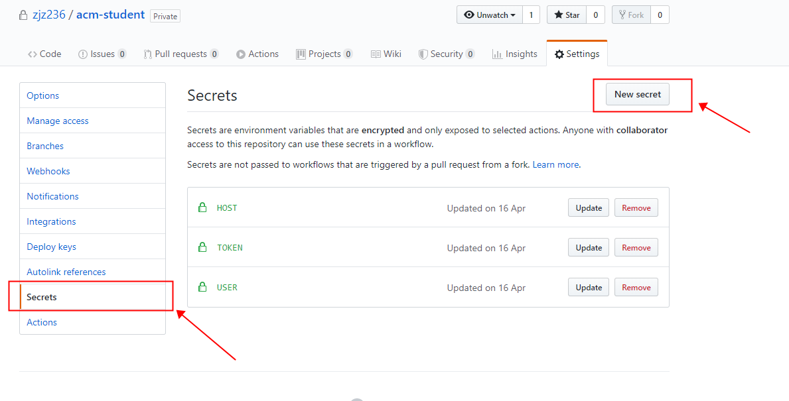
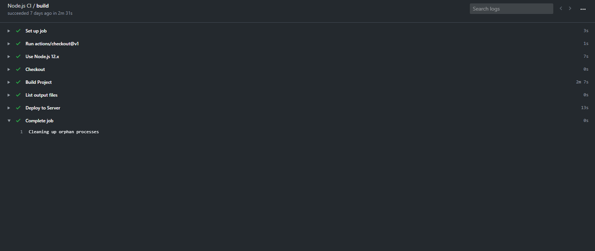

# 简单的GitHub Actions流程

## 什么是GitHub Actions

Github Actions是Github的持续集成服务。

### 持续集成

持续集成指的是，频繁地（一天多次）将代码集成主干。

### 持续集成的优势

和我们一直在使用的 阶段集成（完成一个阶段的开发后执行代码的集成） 相比， 持续集成 的策略能够为我们带来哪些好处呢？

**易于定位错误：**每一次的代码集成都需要执行相关的测试工作，持续集成频繁的集成次数天然的将复杂的代码逻辑切割为了小块，也就使得每一次测试中遇到的错误能够更加容易的被定位；
**易于控制开发流程：**更为细致的工作提交也就意味着更容易判断当前的工作进度，这对于管理者规划开发流程而言提供了一个有效的参考，同时也为开发人员省下了汇报工作的时间；
**易于CodeReview：**对于大块工作的切分自然也有助于做 CodeReview；
**易于减少不必要的工作：**build 以及 test 过程的自动化可以为你节约一大票的时间，从而投入到有价值的工作中去。

Github把持续集成的操作（比如：抓取代码、运行测试、登录远程服务器、发布到第三方服务等等）称为actions。

## 基本概念

GitHub Actions 有一些自己的术语。

（1）**workflow** （工作流程）：持续集成一次运行的过程，就是一个 workflow。

（2）**job** （任务）：一个 workflow 由一个或多个 jobs 构成，含义是一次持续集成的运行，可以完成多个任务。

（3）**step**（步骤）：每个 job 由多个 step 构成，一步步完成。

（4）**action** （动作）：每个 step 可以依次执行一个或多个命令（action）。

## workflow文件

GitHub Actions 的配置文件叫做 workflow 文件，存放在代码仓库的`.github/workflows`目录。

workflow 文件采用 YAML 格式，文件名可以任意取，但是后缀名统一为`.yml`，比如`foo.yml`。一个库可以有多个 workflow 文件。GitHub 只要发现`.github/workflows`目录里面有`.yml`文件，就会自动运行该文件。

workflow 文件的配置字段非常多，详见[官方文档](https://help.github.com/en/articles/workflow-syntax-for-github-actions)。下面是一些基本字段。

**（1）`name`**

`name`字段是 workflow 的名称。如果省略该字段，默认为当前 workflow 的文件名。

> ```bash
> name: GitHub Actions Demo
> ```

**（2）`on`**

`on`字段指定触发 workflow 的条件，通常是某些事件。

> ```bash
> on: push
> ```

上面代码指定，`push`事件触发 workflow。

`on`字段也可以是事件的数组。

> ```bash
> on: [push, pull_request]
> ```

上面代码指定，`push`事件或`pull_request`事件都可以触发 workflow。

完整的事件列表，请查看[官方文档](https://help.github.com/en/articles/events-that-trigger-workflows)。除了代码库事件，GitHub Actions 也支持外部事件触发，或者定时运行。

**（3）`on..`**

指定触发事件时，可以限定分支或标签。

> ```bash
> on:
>   push:
>     branches:    
>       - master
> ```

上面代码指定，只有`master`分支发生`push`事件时，才会触发 workflow。

**（4）`jobs..name`**

workflow 文件的主体是`jobs`字段，表示要执行的一项或多项任务。

`jobs`字段里面，需要写出每一项任务的`job_id`，具体名称自定义。`job_id`里面的`name`字段是任务的说明。

> ```javascript
> jobs:
>   my_first_job:
>     name: My first job
>   my_second_job:
>     name: My second job
> ```

上面代码的`jobs`字段包含两项任务，`job_id`分别是`my_first_job`和`my_second_job`。

**（5）`jobs..needs`**

`needs`字段指定当前任务的依赖关系，即运行顺序。

> ```javascript
> jobs:
>   job1:
>   job2:
>     needs: job1
>   job3:
>     needs: [job1, job2]
> ```

上面代码中，`job1`必须先于`job2`完成，而`job3`等待`job1`和`job2`的完成才能运行。因此，这个 workflow 的运行顺序依次为：`job1`、`job2`、`job3`。

**（6）`jobs..runs-on`**

`runs-on`字段指定运行所需要的虚拟机环境。它是必填字段。目前可用的虚拟机如下。

> - `ubuntu-latest`，`ubuntu-18.04`或`ubuntu-16.04`
> - `windows-latest`，`windows-2019`或`windows-2016`
> - `macOS-latest`或`macOS-10.14`

下面代码指定虚拟机环境为`ubuntu-18.04`。

> ```javascript
> runs-on: ubuntu-18.04
> ```

**（7）`jobs..steps`**

`steps`字段指定每个 Job 的运行步骤，可以包含一个或多个步骤。每个步骤都可以指定以下三个字段。

> - `jobs..steps.name`：步骤名称。
> - `jobs..steps.run`：该步骤运行的命令或者 action。
> - `jobs..steps.env`：该步骤所需的环境变量。

下面是一个完整的 workflow 文件的范例。

> ```javascript
> name: Greeting from Mona
> on: push
> 
> jobs:
>   my-job:
>     name: My Job
>     runs-on: ubuntu-latest
>     steps:
>     - name: Print a greeting
>       env:
>         MY_VAR: Hi there! My name is
>         FIRST_NAME: Mona
>         MIDDLE_NAME: The
>         LAST_NAME: Octocat
>       run: |
>         echo $MY_VAR $FIRST_NAME $MIDDLE_NAME $LAST_NAME.
> ```

上面代码中，`steps`字段只包括一个步骤。该步骤先注入四个环境变量，然后执行一条 Bash 命令。

## 实例：将自己的umi项目部署到Github Actions

首先在自己的项目中创建一个umi的项目，后续流程表示你已经创建好了umi的项目，如有问题，请参考[官方网站](https://umijs.org/)。

第一步，在自己GitHub的项目仓库中的导航栏中，查看是否有Actions一栏。



如果没有，请在`Settings/Actions`里打开。



第二步，将自己的所需要存储的秘密的环境变量，进行设置，具体可参考[官方文档](https://help.github.com/en/articles/creating-a-personal-access-token-for-the-command-line)。然后，将这个密钥储存到当前仓库的`Settings/Secrets`里面。i



第三步，在这个仓库的`.github/workflows`目录，生成一个workflow文件，名字随便取，我取的是nodejs.yml。

```yml
# This workflow will do a clean install of node dependencies, build the source code and run tests across different versions of node
# For more information see: https://help.github.com/actions/language-and-framework-guides/using-nodejs-with-github-actions

name: Node.js CI

on:
  push:
    branches: v1.2.0_毕设

jobs:
  build:

    runs-on: ubuntu-16.04

    steps:
      - uses: actions/checkout@v1
        with:
          fetch-depth: 1

      - name: Use Node.js 12.x
        uses: actions/setup-node@v1
        with:
          node-version: '12.x'

      - name: Checkout # 此步骤（step）的名字
        run: git checkout -b v1.2.0_毕设 origin/v1.2.0_毕设

      - name: Build Project # 此步骤（step）的名字
        run: npm install && npm run build

      - name: List output files
        run: ls -a dist # 显示生成的目录文件

      # step2: 将源码复制到服务器 #坑
      - name: Deploy to Server
        uses: easingthemes/ssh-deploy@v2.1.2
        env:
          # 这个地方的用法会在下面解释，简单的说就是一个变量
          # 为了安全，被写在一个其他的地方
          SSH_PRIVATE_KEY: ${{ secrets.TOKEN }}
          REMOTE_HOST: ${{ secrets.HOST }}
          REMOTE_USER: ${{ secrets.USER }}
          SOURCE: 'dist/'
          TARGET: '/usr/local/nginx/html/stu/'
          ARGS: '-avzr --delete'

```

第五步，保存文件以后，将仓库推到GitHub。然后GitHub发现workflow文件以后，就会自动运行。

