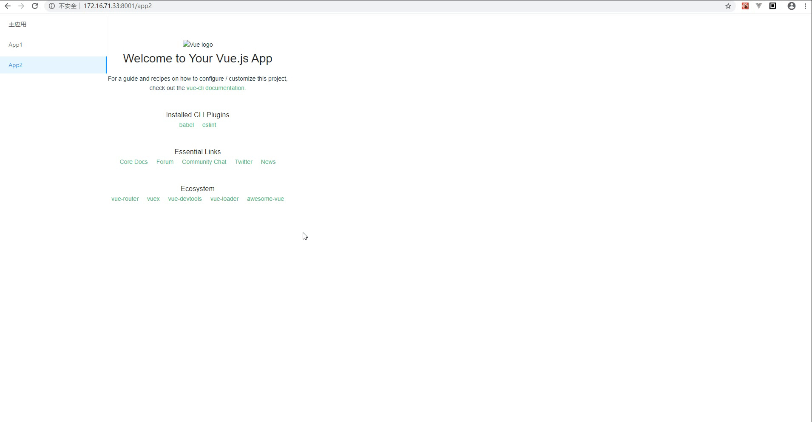

# 微前端的实战

之前接触过一段时间的微前端，现在记录一个关于微前端的实战流程，方便后续使用时的回忆。

## 什么是微前端

什么是微前端，引用phodal大佬的话来说

> 微前端架构是一种类似于微服务的架构，它将微服务的理念应用于浏览器端，即将 Web 应用由单一的单体应用转变为**多个小型前端应用聚合为一的应用**。

## 微前端的实现方式

目前来说，微前端有六种实现方式：

1. 使用 HTTP 服务器的路由来重定向多个应用
2. 在不同的框架之上设计通讯、加载机制，诸如 [Mooa](https://github.com/phodal/mooa) 和 [Single-SPA](https://github.com/CanopyTax/single-spa)
3. 通过组合多个独立应用、组件来构建一个单体应用
4. iFrame。使用 iFrame 及自定义消息传递机制
5. 使用纯 Web Components 构建应用
6. 结合 Web Components 构建

这六种方式我有些也不是太会，所以暂时留个[大佬的文档](https://github.com/phodal/microfrontends#%E5%BE%AE%E5%89%8D%E7%AB%AF%E7%9A%84%E9%82%A3%E4%BA%9B%E4%BA%8B%E5%84%BF)，方便大家自己琢磨。

## 实战过程

我这边采用的技术栈分别为

微前端插件：[乾坤](https://qiankun.umijs.org/zh/)

主应用：[umi3](https://umijs.org/zh-CN)

子应用：umi3和[Vue Cli4](https://cli.vuejs.org/)

### 主应用

首先先创建一个umi3的主应用。

```bash
mkdir parent && cd parent
```

```bash
yarn create @umijs/umi-app
# 或 npx @umijs/create-umi-app

Copy:  .editorconfig
Write: .gitignore
Copy:  .prettierignore
Copy:  .prettierrc
Write: .umirc.ts
Copy:  mock/.gitkeep
Write: package.json
Copy:  README.md
Copy:  src/pages/index.less
Copy:  src/pages/index.tsx
Copy:  tsconfig.json
Copy:  typings.d.ts
```

安装好全部依赖以后，安装乾坤的插件。

```bash
yarn add @umijs/plugin-qiankun
```

这边为了方便，安装个antd库。

```bash
yarn add antd
```

先做一个简单的导航页面，src/pages/index.tsx如下：

```typescript
import React from 'react';
import { Menu } from 'antd';
import {history} from 'umi';

export default (props: any) => {
  return <div style={{ width: '100%', height: '100%', display: 'flex' }}>
    <div style={{ width: 256 }}>
      <Menu
        defaultSelectedKeys={['0']}
        defaultOpenKeys={['sub0']}
        mode="inline"
      >
        <Menu.Item key="0" onClick={()=>history.push('/')}>
          主应用
        </Menu.Item>
        <Menu.Item key="1" onClick={()=>history.push('/app1')}>
          App1
        </Menu.Item>
        <Menu.Item key="2" onClick={()=>history.push('/app2')}>
          App2
        </Menu.Item>
      </Menu>
    </div>
    {props.children}
  </div>;
}

```

然后分别弄两个子应用的容器页面分别为app1.tsx和app2.tsx。

```typescript
//app1.tsx
import React from 'react';

export default () => {
  return <div id="app1" style={{width: '100%'}}></div>;
}
```

```typescript
//app2.tsx
import React from 'react';

export default () => {
  return <div id="app2" style={{width: '100%'}}></div>;
}
```

修改配置文件.umirc.ts

```typescript
import { defineConfig } from 'umi';

export default defineConfig({
  nodeModulesTransform: {
    type: 'none',
  },
  routes: [
    {
      path: '/',
      component: '@/pages/index',
      routes: [
        {
          path: '/',
          component: '@/pages/mine'
        },
        // app1 容器路由
        {
          path: '/app1',
          component: '@/pages/app1'
        },
        // app2 容器路由
        {
          path: '/app2',
          component: '@/pages/app2'
        }
      ]
    },
  ],
  qiankun: {
    master: {
      apps: [
        // 注册子应用信息
        {
          name: 'app1', // 唯一 id
          entry: '//localhost:8888', // html entry
          base: '/app1', // app1 的路由前缀，通过这个前缀判断是否要启动该应用，通常跟子应用的 base 保持一致
          history: 'browser', // 子应用的 history 配置，默认为当前主应用 history 配置
          mountElementId: 'app1' // 子应用挂载到主应用的哪个 id 节点上（注意不要跟子应用的 mountElementId 一致）
        },
        {
          name: 'app2', // 唯一 id
          entry: '//localhost:8080', // html entry
          base: '/app2', // app1 的路由前缀，通过这个前缀判断是否要启动该应用，通常跟子应用的 base 保持一致
          mountElementId: 'app2' // 子应用挂载到主应用的哪个 id 节点上（注意不要跟子应用的 mountElementId 一致）
        }
      ]
    }
  },
  antd: {},
});
```

### umi的子应用

首先先创建一个umi3的子应用。

```bash
mkdir app1 && cd app1
```

```bash
yarn create @umijs/umi-app
# 或 npx @umijs/create-umi-app

Copy:  .editorconfig
Write: .gitignore
Copy:  .prettierignore
Copy:  .prettierrc
Write: .umirc.ts
Copy:  mock/.gitkeep
Write: package.json
Copy:  README.md
Copy:  src/pages/index.less
Copy:  src/pages/index.tsx
Copy:  tsconfig.json
Copy:  typings.d.ts
```

安装好全部依赖以后，安装乾坤的插件。

```bash
yarn add @umijs/plugin-qiankun
```

修改配置文件.umirc.ts

```typescript
import { defineConfig } from 'umi';

export default defineConfig({
  nodeModulesTransform: {
    type: 'none',
  },
  base: '/app1',
  routes: [
    { path: '/', component: '@/pages/index' },
  ],
  qiankun: {slave: {}}
});
```

### Vue Cli4的子应用

首先先创建一个Vue Cli4的子应用。

```bash
vue create app2
```

在入口文件main.js中进行如下修改

```javascript
import Vue from "vue";
import App from "./App.vue";

Vue.config.productionTip = false;

// 声明变量管理vue及路由实例
let instance = null;

// 导出子应用生命周期 挂载前
export async function bootstrap(props) {
  console.log(props)
}

// 导出子应用生命周期 挂载前 挂载后
export async function mount() {
  instance = new Vue({
    render: h => h(App)
  }).$mount("#app");
}

// 导出子应用生命周期 挂载前 卸载后
export async function unmount() {
  instance.$destroy();
  instance = null;
}

// 单独开发环境
mount();
```

最好配置vue.config.js

```javascript
const packageName = require('./package.json').name;
module.exports = {
  devServer: {
    // host: '0.0.0.0',
    hot: true,
    disableHostCheck: true,
    overlay: {
      warnings: false,
      errors: true,
    },
    headers: {
      'Access-Control-Allow-Origin': '*',
    },
  },
  // 自定义webpack配置
  configureWebpack: {
    output: {
      // 把子应用打包成 umd 库格式
      library: `${packageName.name}-[name]`,
      libraryTarget: 'umd',
      jsonpFunction: `webpackJsonp_${packageName}`,
    },
  },
};
```

最后大功告成

