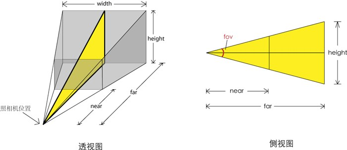

# Threejs 学习

开始准备学习 three.js，记录自己的学习经历。

## 了解 Three

> [Three.js](http://threejs.org/)是一个 3D JavaScript 库

Three 是一个基于原生 WebGL 封装运行的三维引擎，并且是国内使用最广泛的的三维引擎。Three.js 封装了底层的图形接口，使得程序员能够在无需掌握繁冗的图形学知识的情况下，也能用简单的代码实现三维场景的渲染。

## Three.js 功能概览

下面是 Three 的一些关键词

```
Cameras（照相机，控制投影方式）

    Camera
    OrthographicCamera（正交投影照相机）
    PerspectiveCamera（透视投影照相机）

Core（核心对象）

    BufferGeometry
    Clock（用来记录时间）
    EventDispatcher
    Face3
    Face4
    Geometry
    Object3D
    Projector
    Raycaster（计算鼠标拾取物体时很有用的对象）

Lights（光照）
    Light
    AmbientLight
    AreaLight
    DirectionalLight
    HemisphereLight
    PointLight
    SpotLight

Loaders（加载器，用来加载特定文件）
    Loader
    BinaryLoader
    GeometryLoader
    ImageLoader
    JSONLoader
    LoadingMonitor
    SceneLoader
    TextureLoader

Materials（材质，控制物体的颜色、纹理等）
    Material
    LineBasicMaterial
    LineDashedMaterial
    MeshBasicMaterial
    MeshDepthMaterial
    MeshFaceMaterial
    MeshLambertMaterial
    MeshNormalMaterial
    MeshPhongMaterial
    ParticleBasicMaterial
    ParticleCanvasMaterial
    ParticleDOMMaterial
    ShaderMaterial
    SpriteMaterial

Math（和数学相关的对象）

    Box2
    Box3
    Color
    Frustum
    Math
    Matrix3
    Matrix4
    Plane
    Quaternion
    Ray
    Sphere
    Spline
    Triangle
    Vector2
    Vector3
    Vector4

Objects（物体）

    Bone
    Line
    LOD
    Mesh（网格，最常用的物体）
    MorphAnimMesh
    Particle
    ParticleSystem
    Ribbon
    SkinnedMesh
    Sprite

Renderers（渲染器，可以渲染到不同对象上）

    CanvasRenderer
    WebGLRenderer（使用WebGL渲染，这是本书中最常用的方式）
    WebGLRenderTarget
    WebGLRenderTargetCube
    WebGLShaders（着色器，在最后一章作介绍）

Renderers / Renderables

    RenderableFace3
    RenderableFace4
    RenderableLine
    RenderableObject
    RenderableParticle
    RenderableVertex

Scenes（场景）

    Fog
    FogExp2
    Scene

Textures（纹理）

    CompressedTexture
    DataTexture
    Texture

Extras

    FontUtils
    GeometryUtils
    ImageUtils
    SceneUtils

Extras / Animation

    Animation
    AnimationHandler
    AnimationMorphTarget
    KeyFrameAnimation

Extras / Cameras

    CombinedCamera
    CubeCamera

Extras / Core

    Curve
    CurvePath
    Gyroscope
    Path
    Shape

Extras / Geometries（几何形状）

    CircleGeometry
    ConvexGeometry
    CubeGeometry
    CylinderGeometry
    ExtrudeGeometry
    IcosahedronGeometry
    LatheGeometry
    OctahedronGeometry
    ParametricGeometry
    PlaneGeometry
    PolyhedronGeometry
    ShapeGeometry
    SphereGeometry
    TetrahedronGeometry
    TextGeometry
    TorusGeometry
    TorusKnotGeometry
    TubeGeometry

Extras / Helpers

    ArrowHelper
    AxisHelper
    CameraHelper
    DirectionalLightHelper
    HemisphereLightHelper
    PointLightHelper
    SpotLightHelper

Extras / Objects

    ImmediateRenderObject
    LensFlare
    MorphBlendMesh

Extras / Renderers / Plugins

    DepthPassPlugin
    LensFlarePlugin
    ShadowMapPlugin
    SpritePlugin

Extras / Shaders

    ShaderFlares
    ShaderSprite
```

由于目前了解的不多，暂时按照文档先弄个 hello world

## Hello World

一个 three 的程序必须要有三个组成部分：Renderer（渲染器）、Scene（场景）、照相机（Camera），最后在包括你要在场景里面所创建的物体。

首先先在`<head>`中声明 three.js

```html
<head>
  <script type="text/javascript" src="js/three.js"></script>
</head>
```

WebGL 的渲染是需要 Canvas 元素，所以我们可以手动定义在`<body>`中定义 Canvas 元素，也可以通过 Three.js 生成。

手动定义：

```html
<body>
  <canvas id="mainCanvas" width="400px" height="300px"></canvas>
</body>
```

通过 Three.js 生成：

```javascript
var renderer = new THREE.WebGLRenderer();
renderer.setSize(400, 300);
document.getElementsByTagName('body')[0].appendChild(renderer.domElement);
```

如果是通过手动定义的方式，那么我们在将渲染器和 Canvas 元素进行绑定时，需要这么写：

```javascript
var renderer = new THREE.WebGLRenderer({
  canvas: document.getElementById('mainCanvas'),
});
```

在 Three.js 中添加的物体都是添加到场景中的，因此它相当于一个大容器。一般说，场景里没有很复杂的操作，在程序最开始的时候进行实例化，然后将物体添加到场景中。

```javascript
var scene = new THREE.Scene();
```

WebGL 和 Three.js 使用的坐标系是右手坐标系，如下图所示：


这里我们首先先定义一个透视照相机，

```javascript
var camera = new THREE.PerspectiveCamera(45, 4 / 3, 1, 1000);
camera.position.set(0, 0, 5);
scene.add(camera);
```

然后再创建一个 x、y、z 方向分别为 1、2、3 的长方体，并且颜色为红色。

```javascript
var cube = new THREE.Mesh(
  new THREE.CubeGeometry(1, 2, 3),
  new THREE.MeshBasicMaterial({
    color: 0xff0000,
  }),
);
scene.add(cube);
```

最后场景里所有的物体都定义好和添加以后，并且设置好照相机，我们就要将其渲染出来：

```javascript
renderer.render(scene, camera);
```

最后完整代码和渲染效果如所示：

```jsx
import React, { useEffect, useRef } from 'react';

export default () => {
  const canvas = useRef();
  useEffect(() => {
    init();
  }, []);
  const init = () => {
    const renderer = new THREE.WebGLRenderer({
      canvas: canvas.current,
    });
    renderer.setClearColor(0x000000);

    const scene = new THREE.Scene();

    const camera = new THREE.PerspectiveCamera(45, 4 / 3, 1, 1000);
    camera.position.set(0, 0, 5);
    scene.add(camera);

    const cube = new THREE.Mesh(
      new THREE.CubeGeometry(1, 2, 3),
      new THREE.MeshBasicMaterial({
        color: 0xff0000,
      }),
    );
    scene.add(cube);

    renderer.render(scene, camera);
  };
  return (
    <div>
      <canvas
        className="mainCanvas"
        ref={canvas}
        height="300px"
        width="400px"
      ></canvas>
    </div>
  );
};
```

## 照相机（Camera）

### 什么是照相机？

Three.js 是一个三维的场景，而显示屏是一个二维的场景，而如何将三维的场景显示到二维的显示屏上？就需要用到照相机这个方式，它定义了三维空间到二维屏幕的投影方式。

### 正交投影和透视投影

投影包含了两种投影方式，正交投影和透视投影。正交投影就像下图（b）中所示，在三维中平行的线，投放到二维空间里也是平行的。而透视投影如图（a）所示，就像我们的眼睛一样，有“近大远小”这种效果。


### 正交投影

正交投影照相机（Orthographic Camera）的构造函数：

```javascript
THREE.OrthographicCamera(left, right, top, bottom, near, far);
```

这六个参数分别代表了正交投影照相机可以拍到的空间的六个面的位置


- left — 摄像机视锥体左侧面。
- right — 摄像机视锥体右侧面。
- top — 摄像机视锥体上侧面。
- bottom — 摄像机视锥体下侧面。
- near — 摄像机视锥体近端面。
- far — 摄像机视锥体远端面。

其中，left 的值不能够大于 right 的值，而且 left 和 right 设置的值必须位于摄像机 position 中 x 坐标的两侧，否则将看不到影像。对应的 top 和 bottom 也一样，bottom 值不能大于 top 值，且位于摄像机 position 坐标 y 值两边，否则也会看不到投影影像。near 和 far 分别用来设置摄像机近端面和远端面，也就是通常说的最近距离和最远距离。near 设置越小，投影的影像就越大，反之则越小。但是 near 值并不是影响投影物体大小最大的，影响投影物体尺寸最大的还是 left，right，top，bottom 四个参数，而且也影响投影物体的形状，所以在设置这四个参数的时候，left 与 right 之间的距离和 top 与 bottom 之间的距离的比例一定要和原始的 canvas 画布比例相等，不然会导致投影的物体形状变形。

#### 实例

设置照相机：

```javascript
var camera = new THREE.OrthographicCamera(-2, 2, 1.5, -1.5, 1, 10);
camera.position.set(0, 0, 5);
scene.add(camera);
```

在原点处创建一个边长为`1`的正方体：

```javascript
var cube = new THREE.Mesh(
  new THREE.CubeGeometry(1, 1, 1),
  new THREE.MeshBasicMaterial({
    color: 0xff0000,
    wireframe: true,
  }),
);
scene.add(cube);
```

得到的效果是：

```jsx
import React, { useEffect, useRef } from 'react';

export default () => {
  const canvas = useRef();
  useEffect(() => {
    init();
  }, []);
  const init = () => {
    const renderer = new THREE.WebGLRenderer({
      canvas: canvas.current,
    });
    renderer.setClearColor(0x000000);

    const scene = new THREE.Scene();

    const camera = new THREE.OrthographicCamera(-2, 2, 1.5, -1.5, 1, 10);
    camera.position.set(0, 0, 5);
    scene.add(camera);

    const cube = new THREE.Mesh(
      new THREE.CubeGeometry(1, 1, 1),
      new THREE.MeshBasicMaterial({
        color: 0xff0000,
        wireframe: true,
      }),
    );
    scene.add(cube);

    // render
    renderer.render(scene, camera);
  };
  return (
    <div>
      <canvas
        className="mainCanvas"
        ref={canvas}
        height="300px"
        width="400px"
      ></canvas>
    </div>
  );
};
```

因为我们的照相机是按照 Canvas 的比例设置的，如果我们将 Canvas 的比例进行修改：

```javascript
var camera = new THREE.OrthographicCamera(-1, 1, 1.5, -1.5, 1, 10);
```

最后的效果是：

```jsx
import React, { useEffect, useRef } from 'react';

export default () => {
  const canvas = useRef();
  useEffect(() => {
    init();
  }, []);
  const init = () => {
    const renderer = new THREE.WebGLRenderer({
      canvas: canvas.current,
    });
    renderer.setClearColor(0x000000);

    const scene = new THREE.Scene();

    const camera = new THREE.OrthographicCamera(-1, 1, 1.5, -1.5, 1, 10);
    camera.position.set(0, 0, 5);
    scene.add(camera);

    const cube = new THREE.Mesh(
      new THREE.CubeGeometry(1, 1, 1),
      new THREE.MeshBasicMaterial({
        color: 0xff0000,
        wireframe: true,
      }),
    );
    scene.add(cube);

    // render
    renderer.render(scene, camera);
  };
  return (
    <div>
      <canvas
        className="mainCanvas"
        ref={canvas}
        height="300px"
        width="400px"
      ></canvas>
    </div>
  );
};
```

后面我们把照相机向右移动一个单位：

```javascript
var camera = new THREE.OrthographicCamera(-2, 2, 1.5, -1.5, 1, 10);
camera.position.set(1, 0, 5);
```

所得到的效果：

```jsx
import React, { useEffect, useRef } from 'react';

export default () => {
  const canvas = useRef();
  useEffect(() => {
    init();
  }, []);
  const init = () => {
    const renderer = new THREE.WebGLRenderer({
      canvas: canvas.current,
    });
    renderer.setClearColor(0x000000);

    const scene = new THREE.Scene();

    const camera = new THREE.OrthographicCamera(-2, 2, 1.5, -1.5, 1, 10);
    camera.position.set(1, 0, 5);
    scene.add(camera);

    const cube = new THREE.Mesh(
      new THREE.CubeGeometry(1, 1, 1),
      new THREE.MeshBasicMaterial({
        color: 0xff0000,
        wireframe: true,
      }),
    );
    scene.add(cube);

    // render
    renderer.render(scene, camera);
  };
  return (
    <div>
      <canvas
        className="mainCanvas"
        ref={canvas}
        height="300px"
        width="400px"
      ></canvas>
    </div>
  );
};
```

因为我们使用照相机都是沿 z 轴的负方向看正方体，现在我们尝试仰望正方体

```
camera.position.set(4, -3, 5);
```

```jsx
import React, { useEffect, useRef } from 'react';

export default () => {
  const canvas = useRef();
  useEffect(() => {
    init();
  }, []);
  const init = () => {
    const renderer = new THREE.WebGLRenderer({
      canvas: canvas.current,
    });
    renderer.setClearColor(0x000000);

    const scene = new THREE.Scene();

    const camera = new THREE.OrthographicCamera(-2, 2, 1.5, -1.5, 1, 10);
    camera.position.set(4, -3, 5);
    scene.add(camera);

    const cube = new THREE.Mesh(
      new THREE.CubeGeometry(1, 1, 1),
      new THREE.MeshBasicMaterial({
        color: 0xff0000,
        wireframe: true,
      }),
    );
    scene.add(cube);

    // render
    renderer.render(scene, camera);
  };
  return (
    <div>
      <canvas
        className="mainCanvas"
        ref={canvas}
        height="300px"
        width="400px"
      ></canvas>
    </div>
  );
};
```

但是现在照相机沿 z 轴负方向观察的，因此观察不到正方体，只看到一片黑。我们可以通过`lookAt`函数指定它看着原点方向：

```javascript
camera.lookAt(new THREE.Vector3(0, 0, 0));
```

```jsx
import React, { useEffect, useRef } from 'react';

export default () => {
  const canvas = useRef();
  useEffect(() => {
    init();
  }, []);
  const init = () => {
    const renderer = new THREE.WebGLRenderer({
      canvas: canvas.current,
    });
    renderer.setClearColor(0x000000);

    const scene = new THREE.Scene();

    const camera = new THREE.OrthographicCamera(-2, 2, 1.5, -1.5, 1, 10);
    camera.position.set(4, -3, 5);
    camera.lookAt(new THREE.Vector3(0, 0, 0));
    scene.add(camera);

    const cube = new THREE.Mesh(
      new THREE.CubeGeometry(1, 1, 1),
      new THREE.MeshBasicMaterial({
        color: 0xff0000,
        wireframe: true,
      }),
    );
    scene.add(cube);

    // render
    renderer.render(scene, camera);
  };
  return (
    <div>
      <canvas
        className="mainCanvas"
        ref={canvas}
        height="300px"
        width="400px"
      ></canvas>
    </div>
  );
};
```

### 透视投影

透视投影照相机（Perspective Camera）的构造函数是：

```javascript
THREE.PerspectiveCamera(fov, aspect, near, far);
```



透视图中，灰色的部分是视景体，是可能被渲染的物体所在的区域。`fov`是视景体竖直方向上的张角（是角度制而非弧度制），如侧视图所示。

`aspect`等于`width / height`，是照相机水平方向和竖直方向长度的比值，通常设为 Canvas 的横纵比例。

`near`和`far`分别是照相机到视景体最近、最远的距离，均为正值，且`far`应大于`near`。

#### 实例

设置照相机：

```javascript
var camera = new THREE.PerspectiveCamera(45, 400 / 300, 1, 10);
camera.position.set(0, 0, 5);
scene.add(camera);
```

在原点处创建一个边长为`1`的正方体：

```javascript
var cube = new THREE.Mesh(
  new THREE.CubeGeometry(1, 1, 1),
  new THREE.MeshBasicMaterial({
    color: 0xff0000,
    wireframe: true,
  }),
);
scene.add(cube);
```

得到的效果是：

```jsx
import React, { useEffect, useRef } from 'react';

export default () => {
  const canvas = useRef();
  useEffect(() => {
    init();
  }, []);
  const init = () => {
    const renderer = new THREE.WebGLRenderer({
      canvas: canvas.current,
    });
    renderer.setClearColor(0x000000);

    const scene = new THREE.Scene();

    const camera = new THREE.PerspectiveCamera(45, 400 / 300, 1, 10);
    camera.position.set(0, 0, 5);
    scene.add(camera);

    const cube = new THREE.Mesh(
      new THREE.CubeGeometry(1, 1, 1),
      new THREE.MeshBasicMaterial({
        color: 0xff0000,
        wireframe: true,
      }),
    );
    scene.add(cube);

    // render
    renderer.render(scene, camera);
  };
  return (
    <div>
      <canvas
        className="mainCanvas"
        ref={canvas}
        height="300px"
        width="400px"
      ></canvas>
    </div>
  );
};
```

如果修改 fov 来修改数值张角，将 45 改成 60，得到的效果如所示：

```jsx
import React, { useEffect, useRef } from 'react';

export default () => {
  const canvas = useRef();
  useEffect(() => {
    init();
  }, []);
  const init = () => {
    const renderer = new THREE.WebGLRenderer({
      canvas: canvas.current,
    });
    renderer.setClearColor(0x000000);

    const scene = new THREE.Scene();

    const camera = new THREE.PerspectiveCamera(60, 400 / 300, 1, 10);
    camera.position.set(0, 0, 5);
    scene.add(camera);

    const cube = new THREE.Mesh(
      new THREE.CubeGeometry(1, 1, 1),
      new THREE.MeshBasicMaterial({
        color: 0xff0000,
        wireframe: true,
      }),
    );
    scene.add(cube);

    // render
    renderer.render(scene, camera);
  };
  return (
    <div>
      <canvas
        className="mainCanvas"
        ref={canvas}
        height="300px"
        width="400px"
      ></canvas>
    </div>
  );
};
```

修改了竖直张角 fov 以后，虽然正方体的实际大小并未改变，但是将照相机的竖直张角设置得更大时，视景体变大了，因而正方体相对于整个视景体的大小就变小了，看起来正方形就显得变小了。

## 几何形状

在创建物体时，需要传入两个参数，一个是几何形状（Geometry），另一个是材质（Material）。

### 基本几何形状

#### 立方体

虽然这一形状的名字叫立方体（CubeGeometry），但它其实是长方体，也就是长宽高可以设置为不同的值。其构造函数是：

```javascript
THREE.CubeGeometry(
  width,
  height,
  depth,
  widthSegments,
  heightSegments,
  depthSegments,
);
```

这里，`width`是 x 方向上的长度；`height`是 y 方向上的长度；`depth`是 z 方向上的长度；后三个参数分别是在三个方向上的分段数，如`widthSegments`为`3`的话，代表 x 方向上水平分为三份。一般情况下不需要分段的话，可以不设置后三个参数，后三个参数的缺省值为`1`。

创建立方体直观简单，如：`new THREE.CubeGeometry(1, 2, 3)`可以创建一个 x 方向长度为`1`，y 方向长度为`2`，z 方向长度为`3`的立方体：

```jsx
import React, { useEffect, useRef } from 'react';

export default () => {
  const canvas = useRef();
  useEffect(() => {
    init();
  }, []);
  const init = () => {
    const renderer = new THREE.WebGLRenderer({
      canvas: canvas.current,
    });
    renderer.setClearColor(0x000000);
    const scene = new THREE.Scene();

    const camera = new THREE.OrthographicCamera(-4, 4, 3, -3, 1, 10);
    camera.position.set(4, 4, 5);
    camera.lookAt(new THREE.Vector3(0, 0, 0));
    scene.add(camera);
    const axesHelper = new THREE.AxesHelper(150);
    scene.add(axesHelper);
    const cube = new THREE.Mesh(
      new THREE.CubeGeometry(1, 2, 3),
      new THREE.MeshBasicMaterial({
        color: 0xff0000,
        wireframe: true,
      }),
    );
    scene.add(cube);
    // render
    renderer.render(scene, camera);
  };
  return (
    <div>
      <canvas
        className="mainCanvas"
        ref={canvas}
        height="300px"
        width="400px"
      ></canvas>
    </div>
  );
};
```

而在设置了分段`new THREE.CubeGeometry(1, 2, 3, 2, 2, 3)`后，效果如下：

```jsx
import React, { useEffect, useRef } from 'react';

export default () => {
  const canvas = useRef();
  useEffect(() => {
    init();
  }, []);
  const init = () => {
    const renderer = new THREE.WebGLRenderer({
      canvas: canvas.current,
    });
    renderer.setClearColor(0x000000);
    const scene = new THREE.Scene();

    const camera = new THREE.OrthographicCamera(-4, 4, 3, -3, 1, 10);
    camera.position.set(4, 4, 5);
    camera.lookAt(new THREE.Vector3(0, 0, 0));
    scene.add(camera);
    const axesHelper = new THREE.AxesHelper(150);
    scene.add(axesHelper);
    const cube = new THREE.Mesh(
      new THREE.CubeGeometry(1, 2, 3, 2, 2, 3),
      new THREE.MeshBasicMaterial({
        color: 0xff0000,
        wireframe: true,
      }),
    );
    scene.add(cube);
    // render
    renderer.render(scene, camera);
  };
  return (
    <div>
      <canvas
        className="mainCanvas"
        ref={canvas}
        height="300px"
        width="400px"
      ></canvas>
    </div>
  );
};
```

#### 平面

这里的平面（PlaneGeometry）其实是一个长方形，而不是数学意义上无限大小的平面。其构造函数为：

```javascript
THREE.PlaneGeometry(width, height, widthSegments, heightSegments);
```

其中，`width`是 x 方向上的长度；`height`是 y 方向上的长度；后两个参数同样表示分段。

`new THREE.PlaneGeometry(2, 4);`创建的平面在 x 轴和 y 轴所在平面内，效果如下：

```jsx
import React, { useEffect, useRef } from 'react';

export default () => {
  const canvas = useRef();
  useEffect(() => {
    init();
  }, []);
  const init = () => {
    const renderer = new THREE.WebGLRenderer({
      canvas: canvas.current,
    });
    renderer.setClearColor(0x000000);
    const scene = new THREE.Scene();

    const camera = new THREE.OrthographicCamera(-4, 4, 3, -3, 1, 10);
    camera.position.set(4, 4, 5);
    camera.lookAt(new THREE.Vector3(0, 0, 0));
    scene.add(camera);
    const axesHelper = new THREE.AxesHelper(150);
    scene.add(axesHelper);
    const cube = new THREE.Mesh(
      new THREE.PlaneGeometry(2, 4),
      new THREE.MeshBasicMaterial({
        color: 0xff0000,
        wireframe: true,
      }),
    );
    scene.add(cube);
    const controls = new THREE.OrbitControls(camera, canvas.current); //创建控件对象
    controls.addEventListener('change', () => renderer.render(scene, camera)); //监听鼠标、键盘事件
    // render
    renderer.render(scene, camera);
  };
  return (
    <div>
      <canvas
        className="mainCanvas"
        ref={canvas}
        height="300px"
        width="400px"
      ></canvas>
    </div>
  );
};
```

#### 球体

球体（SphereGeometry）的构造函数是：

```
THREE.SphereGeometry(radius, segmentsWidth, segmentsHeight, phiStart, phiLength, thetaStart, thetaLength)
```

其中，`radius`是半径；`segmentsWidth`表示经度上的切片数；`segmentsHeight`表示纬度上的切片数；`phiStart`表示经度开始的弧度；`phiLength`表示经度跨过的弧度；`thetaStart`表示纬度开始的弧度；`thetaLength`表示纬度跨过的弧度。

首先，我们来理解下`segmentsWidth`和`segmentsHeight`。使用`var sphere = new THREE.SphereGeometry(3, 8, 6)`可以创建一个半径为 3，经度划分成 8 份，纬度划分成 6 份的球体

```jsx
import React, { useEffect, useRef } from 'react';

export default () => {
  const canvas = useRef();
  useEffect(() => {
    init();
  }, []);
  const init = () => {
    const renderer = new THREE.WebGLRenderer({
      canvas: canvas.current,
    });
    renderer.setClearColor(0x000000);
    const scene = new THREE.Scene();

    const camera = new THREE.OrthographicCamera(-4, 4, 3, -3, 1, 10);
    camera.position.set(4, 4, 5);
    camera.lookAt(new THREE.Vector3(0, 0, 0));
    scene.add(camera);
    const axesHelper = new THREE.AxesHelper(150);
    scene.add(axesHelper);
    const cube = new THREE.Mesh(
      new THREE.SphereGeometry(3, 8, 6),
      new THREE.MeshBasicMaterial({
        color: 0xff0000,
        wireframe: true,
      }),
    );
    scene.add(cube);
    const controls = new THREE.OrbitControls(camera, canvas.current); //创建控件对象
    controls.addEventListener('change', () => renderer.render(scene, camera)); //监听鼠标、键盘事件
    // render
    renderer.render(scene, camera);
  };
  return (
    <div>
      <canvas
        className="mainCanvas"
        ref={canvas}
        height="300px"
        width="400px"
      ></canvas>
    </div>
  );
};
```

`segmentsWidth`相当于经度被切成了几瓣，而`segmentsHeight`相当于纬度被切成了几层。因为在图形底层的实现中，并没有曲线的概念，曲线都是由多个折线近似构成的。对于球体而言，当这两个值较大的时候，形成的多面体就可以近似看做是球体了。

`new THREE.SphereGeometry(3, 18, 12)`的效果：

```jsx
import React, { useEffect, useRef } from 'react';

export default () => {
  const canvas = useRef();
  useEffect(() => {
    init();
  }, []);
  const init = () => {
    const renderer = new THREE.WebGLRenderer({
      canvas: canvas.current,
    });
    renderer.setClearColor(0x000000);
    const scene = new THREE.Scene();

    const camera = new THREE.OrthographicCamera(-4, 4, 3, -3, 1, 10);
    camera.position.set(4, 4, 5);
    camera.lookAt(new THREE.Vector3(0, 0, 0));
    scene.add(camera);
    const axesHelper = new THREE.AxesHelper(150);
    scene.add(axesHelper);
    const cube = new THREE.Mesh(
      new THREE.SphereGeometry(3, 18, 12),
      new THREE.MeshBasicMaterial({
        color: 0xff0000,
        wireframe: true,
      }),
    );
    scene.add(cube);
    const controls = new THREE.OrbitControls(camera, canvas.current); //创建控件对象
    controls.addEventListener('change', () => renderer.render(scene, camera)); //监听鼠标、键盘事件
    // render
    renderer.render(scene, camera);
  };
  return (
    <div>
      <canvas
        className="mainCanvas"
        ref={canvas}
        height="300px"
        width="400px"
      ></canvas>
    </div>
  );
};
```

## 模型的导入

Three.js 有一系列导入外部文件的辅助函数，是在`three.js`之外的，使用前需要额外下载，在https://github.com/mrdoob/three.js/tree/master/examples/js/loaders可以找到。

`*.obj`是最常用的模型格式，导入`*.obj`文件需要`OBJLoader.js`；导入带`*.mtl`材质的`*.obj`文件需要`MTLLoader.js`以及`OBJMTLLoader.js`。另有`PLYLoader.js`、`STLLoader.js`等分别对应不同格式的加载器，可以根据模型格式自行选择。

目前，支持的模型格式有：

- \*.obj
- _.obj, _.mtl
- \*.dae
- \*.ctm
- \*.ply
- \*.stl
- \*.wrl
- \*.vtk

### 无材质的模型

```jsx
import React, { useEffect, useRef } from 'react';
import buildObj from '../../assets/three/building2.obj';
import buildMtl from '../../assets/three/building2.mtl';

export default () => {
  const canvas = useRef();
  useEffect(() => {
    init();
  }, []);
  const init = () => {
    const renderer = new THREE.WebGLRenderer({
      canvas: canvas.current,
    });
    renderer.setClearColor(0x000000);
    const scene = new THREE.Scene();

    const camera = new THREE.PerspectiveCamera(45, 800 / 600, 1, 1000);
    camera.position.set(500, 500, 500);
    camera.lookAt(new THREE.Vector3(0, 0, 0));
    scene.add(camera);
    const controls = new THREE.OrbitControls(camera, canvas.current); //创建控件对象
    controls.addEventListener('change', () => renderer.render(scene, camera)); //监听鼠标、键盘事件
    const loader = new THREE.OBJLoader();
    loader.load(buildObj, obj => {
      scene.add(obj);
      renderer.render(scene, camera);
    });

    // 环境光
    var ambient = new THREE.AmbientLight(0xcccccc, 0.4);
    scene.add(ambient);
    // // 点光源
    var pointLight = new THREE.PointLight(0xffffff);
    pointLight.position.set(110, 110, 110);
    scene.add(pointLight);
    // render
    renderer.render(scene, camera);
  };
  return (
    <div>
      <canvas
        className="mainCanvas"
        ref={canvas}
        height="600px"
        width="800px"
      ></canvas>
    </div>
  );
};
```

### 有材质的模型

```jsx
import React, { useEffect, useRef } from 'react';
import buildObj from '../../assets/three/building2.obj';
import buildMtl from '../../assets/three/building2.mtl';

export default () => {
  const canvas = useRef();
  useEffect(() => {
    init();
  }, []);
  const init = () => {
    const renderer = new THREE.WebGLRenderer({
      canvas: canvas.current,
    });
    renderer.setClearColor(0x000000);
    const scene = new THREE.Scene();

    const camera = new THREE.PerspectiveCamera(45, 800 / 600, 1, 1000);
    camera.position.set(500, 500, 500);
    camera.lookAt(new THREE.Vector3(0, 0, 0));
    scene.add(camera);
    const controls = new THREE.OrbitControls(camera, canvas.current); //创建控件对象
    controls.addEventListener('change', () => renderer.render(scene, camera)); //监听鼠标、键盘事件
    const OBJLoader = new THREE.OBJLoader(); //obj加载器
    const MTLLoader = new THREE.MTLLoader(); //材质文件加载器
    MTLLoader.load(buildMtl, materials => {
      //obj的模型会和MaterialCreator包含的材质对应起来
      OBJLoader.setMaterials(materials);
      OBJLoader.load(buildObj, function(obj) {
        console.log(obj);
        scene.add(obj); //返回的组对象插入场景中
        renderer.render(scene, camera);
      });
    });

    // 环境光
    var ambient = new THREE.AmbientLight(0xcccccc, 0.4);
    scene.add(ambient);
    // // 点光源
    var pointLight = new THREE.PointLight(0xffffff);
    pointLight.position.set(110, 110, 110);
    scene.add(pointLight);
    // render
    renderer.render(scene, camera);
  };
  return (
    <div>
      <canvas
        className="mainCanvas"
        ref={canvas}
        height="600px"
        width="800px"
      ></canvas>
    </div>
  );
};
```

未完待续
