# 如何创建脚手架

目前社区上有很多优秀的脚手架：`vue-cli`、`create-react-app`、`react-native-cli`等等，通过这些脚手架，我们可以快速初始化项目。但是有些时候，社区上的优秀脚手架未必符合我们的实际应用，那我们就需要定制一个属于我们自己的脚手架。

**脚手架的作用**

- 减少重复性的工作，不需要复制其他项目再删除无关代码，或者从零创建一个项目和文件。
- 可以根据交互动态生成项目结构和配置文件。
- 多人协作更为方便，不需要把文件传来传去。

## 一、脚手架的简单雏形

> **脚手架就是在启动的时候询问一些简单的问题，并且通过用户回答的结果去渲染对应的模板文件**，基本工作流程如下：
>
> 1. 通过命令行交互询问用户问题
> 2. 根据用户回答的结果生成文件

当我们用`vue-cli`创建一个项目的时候，会有以下步骤

**运行创建命令**

```shell
$ vue create vue-project
```

**询问用户问题**

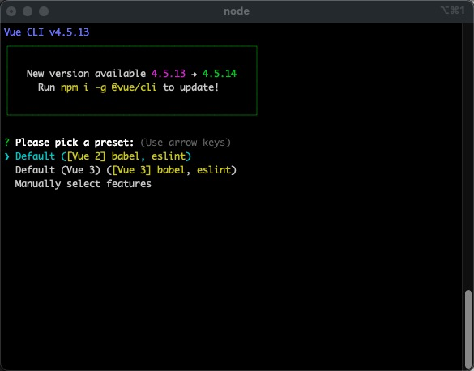

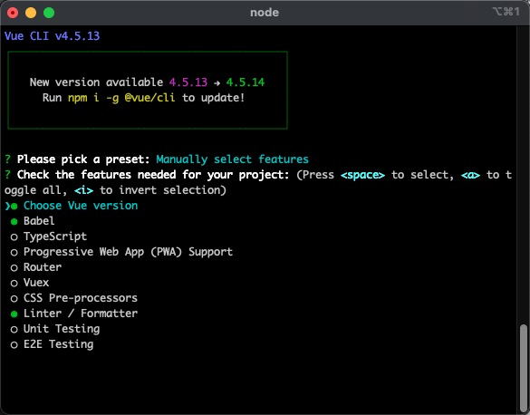

**生成符合用户需求的项目文件**

```
vue-project
├─ index.html
├─ src
│  ├─ App.vue
│  ├─ assets
│  │  └─ logo.png
│  ├─ components
│  │  └─ HelloWorld.vue
│  ├─ main.js
│  └─ router
│     └─ index.js
└─ package.json

```

下面我们根据上面步骤来实现一个简单的脚手架雏形

### 1. 在命令行启用cli

**目标：** 实现在命令行执行 `zjz-cli` 来启动我们的脚手架

#### 1.1 创建zjz-cli项目

```shell
$ mkdir zjz-cli
$ cd zjz-cli
$ npm init
```

#### 1.2 新建入口文件cli.js

```js
#! /usr/bin/env node
// 行首加入一行 #!/usr/bin/env node 指定当前脚本由node.js进行解析

// 用于检查入口文件是否正常执行
console.log('zjz-cli working~')
```

在package.json文件中指定入口文件为cli.js

```json
{
  "name": "zjz-cli",
  "version": "1.0.0",
  "description": "",
  "main": "cli.js",
  "bin": "cli.js",
  "scripts": {
    "test": "echo \"Error: no test specified\" && exit 1"
  },
  "author": "",
  "license": "ISC"
}
```

#### 1.3 npm link链接到全局

```shell
$ npm link
```

执行完成

```shell
$ npm link

changed 1 package, and audited 3 packages in 1s

found 0 vulnerabilities
```

然后在命令行中输入`zjz-cli`执行一下

```shell
$ zjz-cli
```

然后就会看到打印

```shell
zjz-cli working~
```

### 2.询问用户信息

实现与询问用户信息的功能需要引入 [inquirer.js](https://github.com/SBoudrias/Inquirer.js/)

```shell
$ yarn add inquirer -D
```

接着我们在 cli.js 来设置我们的问题

```js
#! /usr/bin/env node
const inquirer = require('inquirer');

inquirer.prompt([
  {
    type: 'input', //type： input, number, confirm, list, checkbox ...
    name: 'name', // key 名
    message: 'Your Name', // 提示信息
    default: 'zjz-cli' // 默认值
  }
]).then(answers => {
  console.log(answers);
});
```

然后在命令行中输入`zjz-cli`看一下执行结果

```shell
$ zjz-cli              
? Your Name zjz-cli
{ name: 'zjz-cli' }
```

### 3.生成对应的文件

#### 3.1 新建模版文件夹以及index.html和common.css两个简单的示例文件

```html
<!-- /template/index.html -->
<!DOCTYPE html>
<html lang="en">
<head>
    <meta charset="UTF-8">
    <!-- ejs 语法-->
    <title>
        <%= name %>
    </title>
</head>
<body>
  <h1><%= name %></h1>
</body>
</html>

```

```css
/* /template/common.css */
body {
    margin: 20px auto;
    background-color: azure;
}
```

此时的目录结构

```
zjz-cli
├── cli.js
├── package.json
├── template
│   ├── common.css
│   └── index.html
└── yarn.lock
```

#### 3.2 完善文件生成逻辑

这里借助 [ejs](https://ejs.bootcss.com/) 模版引擎将用户输入的数据渲染到模版文件上

```shell
$ yarn add ejs
```

完善`cli.js`

```js
#! /usr/bin/env node
const inquirer = require('inquirer');
const path = require('path');
const fs = require('fs');
const ejs = require('ejs');

const exitsFolder = async realPath => {
  try {
    await fs.promises.stat(realPath);
  } catch (e) {
    await fs.promises.mkdir(realPath);
  }
};

inquirer.prompt([
  {
    type: 'input', //type： input, number, confirm, list, checkbox ...
    name: 'name', // key 名
    message: 'Your Name', // 提示信息
    default: 'zjz-cli' // 默认值
  }
]).then(async answers => {
  // 模版文件目录
  const destUrl = path.join(__dirname, 'template');
  // 生成文件目录
  // process.cwd() 对应控制台所在目录
  const cwdUrl = process.cwd();
  // 查看是否有public文件夹 没有的话，创建一个
  const publicUrl = path.join(cwdUrl, '/public');
  await exitsFolder(publicUrl);
  // 从模版目录中读取文件
  const files = await fs.promises.readdir(destUrl);
  for (const file of files) {
    // 使用 ejs 渲染对应的模版文件
    // renderFile（模版文件地址，传入渲染数据）
    const data = await ejs.renderFile(path.join(destUrl, file), answers);
    // 生成ejs处理后的模版文件
    await fs.promises.writeFile(path.join(publicUrl, file), data);
  }
});

```

然后，在控制台中执行`zjz-cli`，此时`index.html`、`common.css`已经成功创建

打印一下当前目录结构

```
zjz-cli
├── cli.js
├── package.json
├── public
│   ├── common.css
│   └── index.html
├── template
│   ├── common.css
│   └── index.html
└── yarn.lock

```

然后看一下生成的`index.html`

```html
<!DOCTYPE html>
<html lang="en">
<head>
    <meta charset="UTF-8">
    <!-- ejs 语法-->
    <title>
        zjz
    </title>
</head>
<body>
  <h1>zjz</h1>
</body>
</html>
```

用户输入的 `{ name: 'zjz' }` 已经添加到了生成的文件中了

## 二、脚手架工具库

实际生产中搭建一个脚手架或者阅读其他脚手架源码的时候需要了解下面这些工具库 

| 名称                                                         | 简介                                                         |
| ------------------------------------------------------------ | ------------------------------------------------------------ |
| [ commander](https://github.com/tj/commander.js/blob/master/Readme_zh-CN.md) | 命令行自定义指令                                             |
| [ inquirer](https://github.com/SBoudrias/Inquirer.js/)       | 命令行询问用户问题，记录回答结果                             |
| [ chalk](https://www.npmjs.com/package/chalk)                | 控制台输出内容样式美化                                       |
| [ ora](https://www.npmjs.com/package/ora)                    | 控制台 loading 样式                                          |
| [ figlet](https://www.npmjs.com/package/figlet)              | 控制台打印 logo                                              |
| [ easy-table](https://www.npmjs.com/package/easy-table)      | 控制台输出表格                                               |
| [ download-git-repo](https://www.npmjs.com/package/download-git-repo) | 下载远程模版                                                 |
| [ fs-extra](https://www.npmjs.com/package/fs-extra)          | 系统fs模块的扩展，提供了更多便利的 API，并继承了fs模块的 API |
| [ cross-spawn](https://www.npmjs.com/package/cross-spawn)    | 支持跨平台调用系统上的命令                                   |

## 三、搭建自己的脚手架

接下来开始真正搭建`zjz-cli`这个脚手架

**需要实现哪些基本功能：**

1. 通过 `zjz create <name>` 命令启动项目
2. 询问用户需要选择需要下载的模板
3. 远程拉取模板文件

**搭建步骤拆解：**

1. 创建项目
2. 创建脚手架启动命令（使用 commander）
3. 询问用户问题获取创建所需信息（使用 inquirer）
4. 下载远程模板（使用 download-git-repo）
5. 发布项目

### 1.创建项目

首先先创建一个一下目录结构

```
zjz-cli
├── README.md
├── bin
│   └── cli.js
└── package.json
```

配置脚手架启动文件

```json
{
  "name": "zjz-cli",
  "version": "1.0.0",
  "description": "",
  "main": "index.js",
  "bin": {
    "zjz": "./bin/cli.js"
  },
  "scripts": {
    "test": "echo \"Error: no test specified\" && exit 1"
  },
  "author": {
    "name": "Zhu Jinze",
    "email": "zjz236@qq.com"
  },
  "license": "ISC"
}
```

简单编辑一下我们的 cli.js

```js
#! /usr/bin/env node

console.log('zhurong-cli working ~')
```

为了方便开发调试，使用 `npm link` 链接到全局

```shell
$ npm link

changed 1 package, and audited 3 packages in 1s

found 0 vulnerabilities
```

完成之后，接着测试一下

```shell
$ zjz
zjz-cli working ~
```

### 2.创建脚手架启动命令

**简单分析一下我们要怎么做？**

1. 首先我们要借助 commander 依赖去实现这个需求
2. 参照 vue-cli 常用的命令有 create、config 等等，在最新版本中可以使用 vue ui 进行可视化创建
3. 如果创建的存在，需要提示是否覆盖

#### 2.1 安装依赖

```shell
$ yarn add commander
```

#### 2.2 创建命令

```js
#! /usr/bin/env node

const commander = require('commander')

commander
  // 定义命令和参数
  .command('create <app-name>')
  .description('create a new project')
  // -f or --force 为强制创建，如果创建的目录存在则直接覆盖
  .option('-f, --force', 'overwrite target directory if it exist')
  .action((name, options) => {
    // 打印执行结果
    console.log('name:',name,'options:',options)
  })

commander
  // 配置版本号信息
  .version(`v${require('../package.json').version}`)
  .usage('<command> [option]')

// 解析用户执行命令传入参数
commander.parse(process.argv);
```

然后在命令行输入`zjz`，检查命令是否创建成功

```shell
$ zjz
Usage: zjz <command> [option]

Options:
  -V, --version                output the version number
  -h, --help                   display help for command

Commands:
  create [options] <app-name>  create a new project
  help [command]               display help for command

```

我们可以看到 Commands 下面已经有了 `create [options] <app-name>`，接着执行一下这个命令

```shell
$ zjz create
error: missing required argument 'app-name'
$ zjz create my-project   
name: my-project options: {}
$ zjz create my-project -f
name: my-project options: { force: true }
$ zjz create my-project --force
name: my-project options: { force: true }
```

成功拿到命令行输入信息

#### 2.3 执行命令

创建lib文件夹并在文件下创建create.js

```js
// lib/create.js

module.exports = async function (name, options) {
  // 验证是否正常取到值
  console.log('>>> create.js', name, options)
}
```

在 cli.js 中使用 create.js

```js
// bin/cli.js

......
commander
  // 定义命令和参数
  .command('create <app-name>')
  .description('create a new project')
  // -f or --force 为强制创建，如果创建的目录存在则直接覆盖
  .option('-f, --force', 'overwrite target directory if it exist')
  .action((name, options) => {
    // 在 create.js 中执行创建任务
    require('../lib/create.js')(name, options)
  })
......
```

执行一下 `zjz create my-project`，此时在 create.js 正常打印了我们出入的信息

```shell
$ zjz create my-project        
>>> create.js my-project {}
```

在创建目录的时候，需要思考一个问题：目录是否已经存在

1. 如果存在
   - 当 `{ force: true }` 时，直接移除原来的目录，直接创建
   - 当 `{ force: false }` 时 询问用户是否需要覆盖
2. 如果不存在，直接创建

那么接着完成create.js内部的实现逻辑

```js
const path = require('path');
const fs = require('fs-extra');
module.exports = async function (name, options) {
  // 当前命令行选择的目录
  const cwd = process.cwd();
  // 需要创建的目录地址
  const targetDir = path.join(cwd, name);
  // 目录是否已存在
  if (fs.pathExistsSync(targetDir)) {
    // 是否强创建
    if (options.force) {
      await fs.remove(targetDir)
    } else {
      // 询问用户是否确定覆盖
    }
  }
}

```

询问逻辑 后面再进行完善

#### 2.4 创建更多命令

```js
// /bin/cli.js

...
// 配置 config 命令
commander
  .command('config [value]')
  .description('inspect and modify the config')
  .option('-g, --get <path>', 'get value from option')
  .option('-s, --set <path> <value>')
  .option('-d, --delete <path>', 'delete option from config')
  .action((value, options) => {
    console.log(value, options)
  })

// 配置 ui 命令
commander
  .command('ui')
  .description('start add open roc-cli ui')
  .option('-p, --port <port>', 'Port used for the UI Server')
  .action((option) => {
    console.log(option)
  })
...
```

#### 2.5 完善帮助信息

首先看一下`vue-cli`执行 `--help`打印的信息

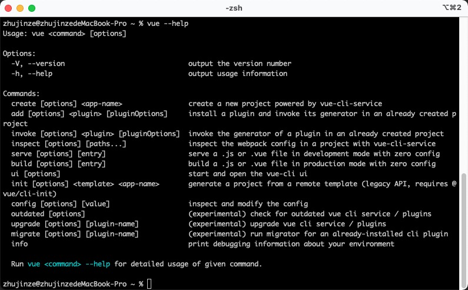

对比 `zjz --help` 打印的结果，结尾处少了一条说明信息，这里我们做补充，重点需要注意**说明信息是带有颜色的**，这里就需要用到我们工具库里面的 [chalk](https://www.npmjs.com/package/chalk) 来处理

```js
commander.on('--help', () => {
  console.log(`\r\nRun ${chalk.cyan(`z <command> --help`)} for detailed usage of given command\r\n`)
})
```

最后执行命令看一下

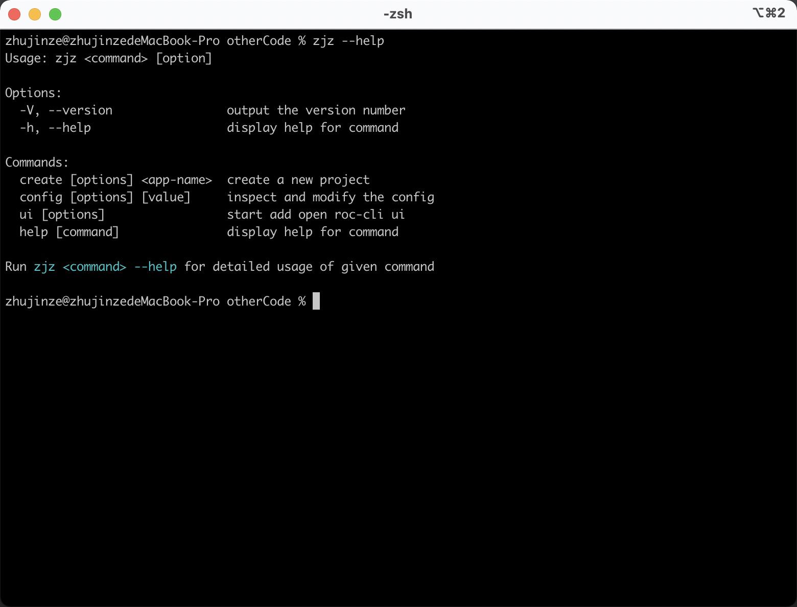

#### 2.6 打印Logo

如果我们想给脚手架整个 Logo，可以用工具库里的 [figlet](https://www.npmjs.com/package/figlet)

```js
commander.on('--help', () => {
  // 使用 figlet 绘制 Logo
  console.log('\r\n' + figlet.textSync('ZhuJinze', {
    font: 'Lil Devil',
    horizontalLayout: 'default',
    verticalLayout: 'default',
    width: 100,
    whitespaceBreak: true
  }))
  // 新增说明信息
  console.log(`\r\nRun ${chalk.cyan(`zr <command> --help`)} for detailed usage of given command\r\n`)
})
```

再看看此时的 `zjz --help` 打印出来的是个什么样子

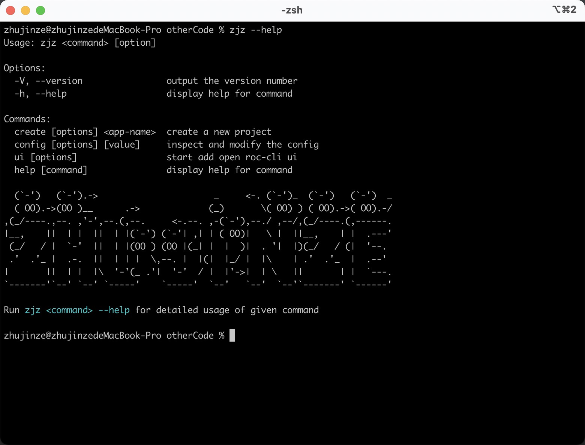

### 3. 询问用户问题获取创建所需信息

这里通过[inquirer](https://www.npmjs.com/package/inquirer)，来解决命令行交互问题

**接下来我们要做的：**

1. 上一步遗留：询问用户是否覆盖已存在的目录
2. 用户选择模板
3. 用户选择版本
4. 获取下载模板的链接

#### 3.1 询问是否覆盖已存在的目录

1. 如果目录已存在
   - 当 `{ force: false }` 时 询问用户是否需要覆盖

```js
const path = require('path');
const fs = require('fs-extra');
const inquirer = require('inquirer')
const chalk = require('chalk');

module.exports = async function (name, options) {
  // 当前命令行选择的目录
  const cwd = process.cwd();
  // 需要创建的目录地址
  const targetDir = path.join(cwd, name);
  // 目录是否已存在
  if (fs.pathExistsSync(targetDir)) {
    // 是否强创建
    if (options.force) {
      await fs.remove(targetDir)
    } else {
      // 询问用户是否确定覆盖
      const { action} = await inquirer.prompt([
        {
          name: 'action',
          type: 'list',
          message: `Target directory ${chalk.cyan(targetDir)} already exists. Pick an action:`,
          choices: [
            {
              name: 'Overwrite',
              value: 'overwrite'
            },
            {
              name: 'Cancel',
              value: false
            }
          ]
        }
      ])
      if (!action) return
      console.log(`\r\nRemoving...`)
      await fs.remove(targetDir)
    }
  }
}
```

#### 3.2 如何获取模版信息

上传两个模版到GitHub上（这里我fork别人的）

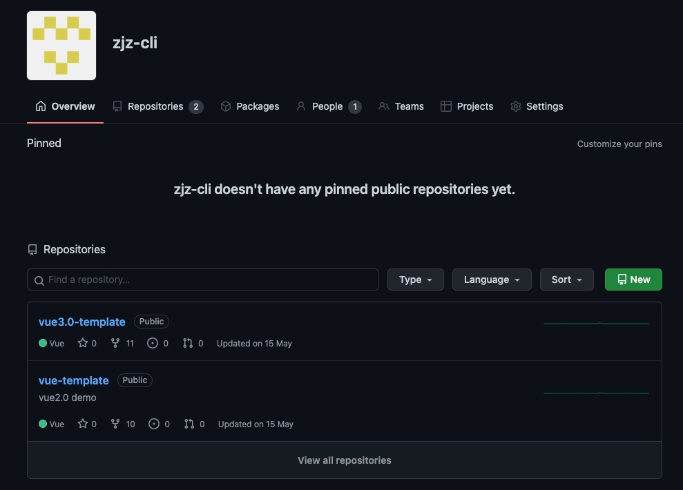

vue3.0-template 版本信息 

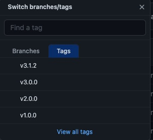

vue-template 版本信息

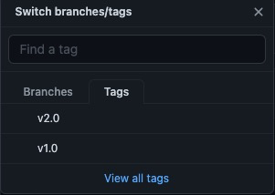

github 提供了

- [https://api.github.com/orgs/zjz-cli/repos](https://api.github.com/orgs/zjz-cli/repos) 接口获取模板信息
- [https://api.github.com/repos/zjz-cli/${repo}/tags](https://api.github.com/repos/zjz-cli/${repo}/tags) 接口获取版本信息

我们在 lib 目录下创建一个 `http.js` 专门处理模板和版本信息的获取

```js
// lib/http.js
// 通过 axios 处理请求
const axios = require('axios')

axios.interceptors.response.use(res => {
  return res.data;
})


/**
 * 获取模板列表
 * @returns Promise
 */
async function getRepoList() {
  return axios.get('https://api.github.com/orgs/zjz-cli/repos')
}

/**
 * 获取版本信息
 * @param {string} repo 模板名称
 * @returns Promise
 */
async function  getTagList(repo) {
  return axios.get(`https://api.github.com/repos/zjz-cli/${repo}/tags`)
}

module.exports = {
  getRepoList,
  getTagList
}
```

#### 3.3 用户选择模板

新建一个 `Generator.js` 来处理项目创建逻辑

```js
// lib/Generator.js
class Generator {
  constructor(name, targetDir) {
    // 目录名称
    this.name = name;
    // 创建位置
    this.targetDir = targetDir;
  }

  // 创建逻辑
  create() {
    
  }
}

module.exports = Generator;
```

在 `create.js `中引入 `Generator` 类

```js
// lib/create.js
...
const Generator = require('./Generator')

module.exports = async function (name, options) {
  ...
  if (fs.pathExistsSync(targetDir)) {
    ...
  }
  
  // Generator
  const generator = new Generator(name, targetDir);
  // 创建项目
  generator.create()
}
```

接着写询问用户选择模版的逻辑

```js
// lib/Generator.js
const { getRepoList } = require('./http');
const ora = require('ora');
const inquirer = require('inquirer');


class Generator {
  constructor(name, targetDir) {
    // 目录名称
    this.name = name;
    // 创建位置
    this.targetDir = targetDir;
  }

  // 获取用户选择的模板
  // 1）从远程拉取模板数据
  // 2）用户选择自己新下载的模板名称
  // 3）return 用户选择的名称
  async getRepo() {
    // 使用 ora 初始化，传入提示信息
    const spinner = ora('waiting fetch template');
    spinner.start();
    try {
      // 1）从远程拉取模板数据
      const repoList = await getRepoList();
      spinner.succeed();
      if (!repoList) return;
      // 过滤我们需要的模板名称
      const repos = repoList.map(item => item.name);

      // 2）用户选择自己新下载的模板名称
      const { repo } = await inquirer.prompt({
        name: 'repo',
        type: 'list',
        choices: repos,
        message: 'Please choose a template to create project'
      });

      // 3）return 用户选择的名称
      return repo;
    } catch (e) {
      // 状态为修改为失败
      spinner.fail('Request failed, refetch ...');
    }
  }

  // 创建逻辑
  // 1）获取模板名称
  async create() {
    // 1）获取模板名称
    const repo = await this.getRepo()
    if (!repo) return

    console.log('用户选择了，repo=' + repo)
  }
}

module.exports = Generator;
```

输入命令行，测试一下

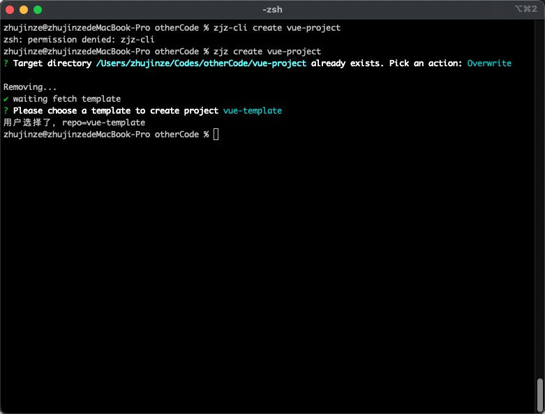

成功拿到模板名称 repo 的结果

#### 3.4 用户选择版本

过程和 3.3 一样

```js
// lib/Generator.js
const { getRepoList, getTagList } = require('./http');
...


class Generator {
  constructor(name, targetDir) {
    // 目录名称
    this.name = name;
    // 创建位置
    this.targetDir = targetDir;
  }

  // 获取用户选择的模板
  // 1）从远程拉取模板数据
  // 2）用户选择自己新下载的模板名称
  // 3）return 用户选择的名称
  async getRepo() {
    ...
  }

  // 获取用户选择的版本
  // 1）基于 repo 结果，远程拉取对应的 tag 列表
  // 2）用户选择自己需要下载的 tag
  // 3）return 用户选择的 tag
  async getTag(repo) {
    // 使用 ora 初始化，传入提示信息
    const spinner = ora('waiting fetch template');
    spinner.start();
    try {
      // 1）基于 repo 结果，远程拉取对应的 tag 列表
      const tags = await getTagList(repo);
      spinner.succeed();
      if (!tags) return;
      // 过滤我们需要的模板名称
      const tagsList = tags.map(item => item.name);

      // 2）用户选择自己新下载的模板名称
      const { tag } = await inquirer.prompt({
        name: 'tag',
        type: 'list',
        choices: tagsList,
        message: 'Please choose a tag to create project'
      });

      // 3）return 用户选择的名称
      return tag;
    } catch (e) {
      // 状态为修改为失败
      spinner.fail('Request failed, refetch ...');
    }
  }

  // 创建逻辑
  // 1）获取模板名称
  // 2）获取 tag 名称
  async create() {
    // 1）获取模板名称
    const repo = await this.getRepo()
    if (!repo) return

    // 2) 获取 tag 名称
    const tag = await this.getTag(repo)

    console.log('用户选择了，repo=', repo, ',tag=', tag)
  }
}

module.exports = Generator;
```

测试一下，执行命令

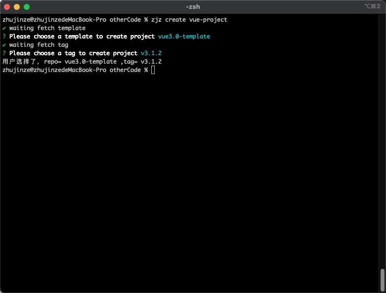

这样询问的工作就结束了，开始进行模版下载了

### 4. 下载远程模板

下载远程模版需要使用 [download-git-repo](https://www.npmjs.com/package/download-git-repo) 工具包，实际上它也在我们上面列的工具菜单上，但是在使用它的时候，需要注意一个问题，就是它是**不支持 promise**的，所以我们这里需要使用 使用` util `模块中的 [promisify](http://nodejs.cn/api/util.html#util_util_promisify_original) 方法对其进行 promise 化

```js
// lib/Generator.js
...
const util = require('util');
const downloadGitRepo = require('download-git-repo');


class Generator {
  constructor(name, targetDir) {
    ...
    this.downloadGitRepo = util.promisify(downloadGitRepo);
  }
  ...
  
  // 下载远程模板
  // 1）拼接下载地址
  // 2）调用下载方法
  async download(repo, tag) {
    // 1）拼接下载地址
    const requestUrl = `zjz-cli/${repo}${tag ? `#${tag}` : ''}`;
    // 使用 ora 初始化，传入提示信息
    const spinner = ora('waiting download template');
    spinner.start();
    try {
      // 2）调用下载方法
      await this.downloadGitRepo(requestUrl, this.targetDir);
    } catch (e) {
      // 状态为修改为失败
    }
  }

  // 创建逻辑
  // 1）获取模板名称
  // 2）获取 tag 名称
  // 3）下载模板到模板目录
  // 4）模板使用提示
  async create() {
    // 1）获取模板名称
    const repo = await this.getRepo();
    if (!repo) return;

    // 2) 获取 tag 名称
    const tag = await this.getTag(repo);

    // 3）下载模板到模板目录
    await this.download(repo, tag);

    // 4）模板使用提示
    // 使用 figlet 绘制 Logo
    console.log('\r\n' + figlet.textSync('ZhuJinze', {
      font: 'Lil Devil',
      horizontalLayout: 'default',
      verticalLayout: 'default',
      width: 100,
      whitespaceBreak: true
    }))
    console.log(`\r\nSuccessfully created project ${chalk.cyan(this.name)}`)
    console.log(`\r\n  cd ${chalk.cyan(this.name)}`)
    console.log('  npm run dev\r\n')
  }
}

module.exports = Generator;
```

最后测试一下效果

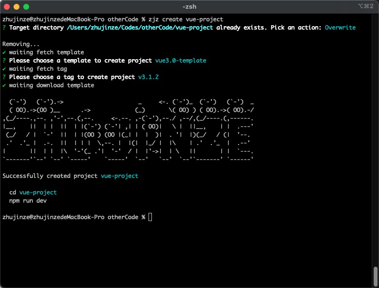

这个时候我们就能看到模版已经创建好了

```
vue-project
├── README.md
├── babel.config.js
├── package.json
├── public
│   ├── favicon.ico
│   └── index.html
└── src
    ├── App.vue
    ├── assets
    │   └── logo.png
    ├── components
    │   └── HelloWorld.vue
    └── main.js
```


