# JavaScript正则表达式

## 一、字符匹配

> 正则表达式是匹配模式，要么匹配字符，要么匹配位置。

### 1.1 两种模糊匹配

正则表达式在方向上分别是横向模糊和纵向模糊。

#### 1.1.1 横向模糊匹配

横向模糊指的是，一个正则可匹配的字符串的长度不是固定的，可以是多种情况的。

其实现的方式是使用量词。譬如` {m,n}`，表示连续出现最少 m 次，最多 n 次。

比如正则` /ab{2,5}c/` 表示匹配这样一个字符串：第一个字符是` "a"`，接下来是 2 到 5 个字符 `"b"`，最后

是字符 `"c"`。

其可视化形式如下：

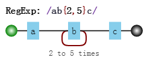

测试如下：

```js
var regex = /ab{2,5}c/g;
var string = "abc abbc abbbc abbbbc abbbbbc abbbbbbc";
console.log( string.match(regex) );
// => ["abbc", "abbbc", "abbbbc", "abbbbbc"]
```

#### 1.1.2 纵向模糊匹配

纵向模糊指的是，一个正则匹配的字符串，具体到某一位字符时，它可以不是某个确定的字符，可以有多种

可能。

其实现的方式是使用字符组。譬如` [abc]`，表示该字符是可以字符` "a"`、`"b"`、`"c"` 中的任何一个。

比如 `/a[123]b/ `可以匹配如下三种字符串：` "a1b"`、`"a2b"`、`"a3b"`。

其可视化形式如下：

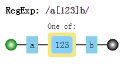

测试如下：

```js
var regex = /a[123]b/g;

var string = "a0b a1b a2b a3b a4b";

console.log( string.match(regex) );

// => ["a1b", "a2b", "a3b"]
```

### 1.2 字符组

例如 [abc]，表示匹配一个字符，它可以是 "a"、"b"、"c" 之一。

#### 1.2.1. 范围表示法

如果字符组里的字符特别多的话，怎么办？可以使用范围表示法。

比如` [123456abcdefGHIJKLM]`，可以写成` [1-6a-fG-M]`。用连字符 - 来省略和简写。

因为连字符有特殊用途，那么要匹配 `"a"`、`"-"`、`"z" `这三者中任意一个字符，该怎么做呢？

不能写成 [a-z]，因为其表示小写字符中的任何一个字符。

可以写成如下的方式：`[-az] `或 `[az-] `或 `[a\-z]`。

即要么放在开头，要么放在结尾，要么转义。总之不会让引擎认为是范围表示法就行了。

#### 1.2.2. 排除字符组

纵向模糊匹配，还有一种情形就是，某位字符可以是任何东西，但就不能是 `"a"`、`"b"`、`"c"`。

此时就是排除字符组（反义字符组）的概念。例如` [^abc]`，表示是一个除` "a"`、`"b"`、`"c"`之外的任意一个字

符。字符组的第一位放 ^（脱字符），表示求反的概念。

当然，也有相应的范围表示法。

#### 1.2.3. 常见的简写形式

有了字符组的概念后，一些常见的符号我们也就理解了。因为它们都是系统自带的简写形式。

| 字符组 | 具体含义                                                     |
| ------ | ------------------------------------------------------------ |
| \d     | 表示`[0-9]`。表示是一位数字。<br />记忆方式：其英文是digit（数字） |
| \D     | 表示 `[^0-9]`。表示除数字外的任意字符。                      |
| \w     | 表示` [0-9a-zA-Z_]`。表示数字、大小写字母和下划线。<br />记忆方式：w 是 word 的简写，也称单词字符。 |
| \W     | 表示 `[^0-9a-zA-Z_]`。非单词字符。                           |
| \s     | 表示` [ \t\v\n\r\f]`。表示空白符，包括空格、水平制表符、垂直制表符、换行符、回车符、换页符号。<br />记忆方式：s 是 space 的首字母，空白符的单词是 white space。 |
| \S     | 表示` [^ \t\v\n\r\f]`。 非空白符。                           |
| .      | 表示 `[^\n\r\u2028\u2029]`。通配符，表示几乎任意字符。换行符、回车符、行分隔符和段分隔符除外。<br />记忆方式：想想省略号 … 中的每个点，都可以理解成占位符，表示任何类似的东西。 |

如果要匹配任意字符怎么办？可以使用 [\d\D]、[\w\W]、[\s\S] 和 [^] 中任何的一个。

以上各字符组对应的可视化形式是：

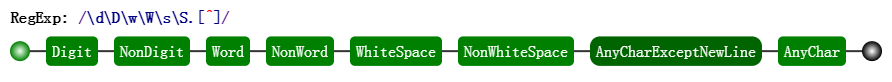

### 1.3 量词

量词也称重复。掌握 {m,n} 的准确含义后，只需要记住一些简写形式。

#### 1.3.1 简写形式

| 量词 | 具体含义                                                     |
| ---- | ------------------------------------------------------------ |
| {m,} | 表示至少出现 m 次。                                          |
| {m}  | 等价于 {m,m}，表示出现 m 次。                                |
| ?    | 等价于 {0,1}，表示出现或者不出现。<br />记忆方式：问号的意思表示，有吗？ |
| +    | 等价于 {1,}，表示出现至少一次。<br />记忆方式：加号是追加的意思，得先有一个，然后才考虑追加。 |
| *    | 等价于 {0,}，表示出现任意次，有可能不出现。<br />记忆方式：看看天上的星星，可能一颗没有，可能零散有几颗，可能数也数不过来。 |

以上量词对应的可视化形式是：

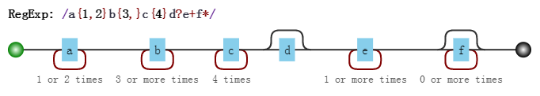

#### 1.3.2 贪婪匹配与惰性匹配

看如下的例子：

```js
var regex = /\d{2,5}/g;

var string = "123 1234 12345 123456";

console.log( string.match(regex) );

// => ["123", "1234", "12345", "12345"]
```

其中正则 `/\d{2,5}/`，表示数字连续出现 2 到 5 次。会匹配 2 位、3 位、4 位、5 位连续数字。

但是其是贪婪的，它会尽可能多的匹配。你能给我 6 个，我就要 6 个。你能给我 3 个，我就要 3 个。

反正只要在能力范围内，越多越好。

而惰性匹配，就是尽可能少的匹配：

```js
var regex = /\d{2,5}?/g;

var string = "123 1234 12345 123456";

console.log( string.match(regex) );

// => ["12", "12", "34", "12", "34", "12", "34", "56"]
```

其中 /\d{2,5}?/ 表示，虽然 2 到 5 次都行，当 2 个就够的时候，就不再往下尝试了。

通过在量词后面加个问号就能实现惰性匹配，因此所有惰性匹配情形如下：

| 惰性量词 | 贪婪量词 |
| -------- | -------- |
| {m,n}?   | {m,n}    |
| {m,}?    | {m,}     |
| ??       | ?        |
| +?       | +        |
| *?       | *        |

> 对惰性匹配的记忆方式是：量词后面加个问号，问一问你知足了吗，你很贪婪吗？

以上惰性量词对应的可视化形式是：

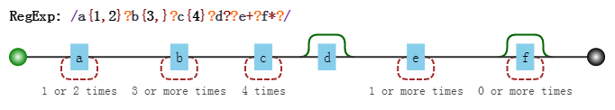

### 1.4 多选分支

一个模式可以实现横向和纵向模糊匹配。而多选分支可以支持多个子模式任选其一。

具体形式如下：(p1|p2|p3)，其中 p1、p2 和 p3 是子模式，用 |（管道符）分隔，表示其中任何之一。

例如要匹配字符串 "good" 和 "nice" 可以使用 `/good|nice/`。

可视化形式如下：

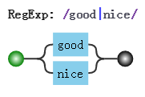

测试如下：

```js
var regex = /good|nice/g;

var string = "good idea, nice try.";

console.log( string.match(regex) );

// => ["good", "nice"]
```

但有个事实我们应该注意，比如我用 `/good|goodbye/`，去匹配 "goodbye" 字符串时，结果是 "good"：

```js
var regex = /good|goodbye/g;

var string = "goodbye";

console.log( string.match(regex) );

// => ["good"]
```

而把正则改成 /goodbye|good/，结果是：

```js
var regex = /goodbye|good/g;

var string = "goodbye";

console.log( string.match(regex) );

// => ["goodbye"]
```

也就是说，分支结构也是惰性的，即当前面的匹配上了，后面的就不再尝试了。

## 二、位置匹配

### 2.1 什么是位置？

位置（锚）是相邻字符之间的位置。比如，下图中箭头所指的地方：

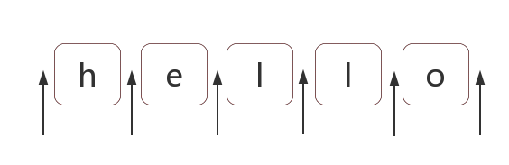

### 2.2 如何匹配位置呢？

在 ES5 中，共有 6 个锚：

`^`、`$`、`\b`、`\B`、`(?=p)`、`(?!p)`

相应的可视化形式是：

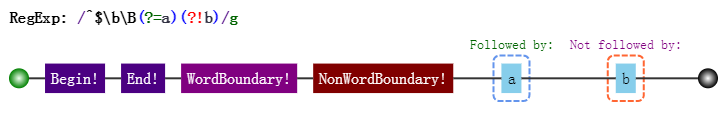

#### 2.2.1 ^ 和 $

`^`（脱字符）匹配开头，在多行匹配中匹配行开头。

`$`（美元符号）匹配结尾，在多行匹配中匹配行结尾。

比如我们把字符串的开头和结尾用 "#" 替换（位置可以替换成字符的！）：

```js
var result = "hello".replace(/^|$/g, '#');

console.log(result);

// => "#hello#"
```

多行匹配模式（即有修饰符 m）时，二者是行的概念，这一点需要我们注意：

```js
var result = "I\nlove\njavascript".replace(/^|$/gm, '#');

console.log(result);

/*

\#I#

\#love#

\#javascript#

*/
```

#### 2.2.2 \b 和 \B

`\b `是单词边界，具体就是 `\w `与 `\W `之间的位置，也包括 `\w` 与 `^ `之间的位置，和 `\w `与 `$` 之间的位置。

比如考察文件名` [JS] Lesson_01.mp4` 中的` \b`，如下：

```js
var result = "[JS] Lesson_01.mp4".replace(/\b/g, '#');

console.log(result);

// => "[#JS#] #Lesson_01#.#mp4#"
```

为什么是这样呢？这需要仔细看看。

首先，我们知道，`\w` 是字符组 `[0-9a-zA-Z_] `的简写形式，即 `\w` 是字母数字或者下划线的中任何一个字

符。而` \W `是排除字符组` [^0-9a-zA-Z_] `的简写形式，即` \W `是` \w `以外的任何一个字符。

此时我们可以看看` [#JS#] #Lesson_01#.#mp4# `中的每一个井号 ，是怎么来的。

• 第 1 个，两边字符是 `[` 与 `J`，是 `\W` 与 `\w `之间的位置。

• 第 2 个，两边字符是 `S` 与 `]`，也就是 `\w `与` \W `之间的位置。

• 第 3 个，两边字符是空格与`L`，也就是` \W `与` \w `之间的位置。

• 第 4 个，两边字符是 `1`与 `.`，也就是 `\w` 与`\W `之间的位置。

• 第 5 个，两边字符是` . `与` m`，也就是` \W `与` \w`之间的位置。

• 第 6 个，位于结尾，前面的字符` 4 `是 \w，即` \w `与 `$ `之间的位置。

知道了` \b `的概念后，那么` \B `也就相对好理解了。

`\B` 就是 `\b` 的反面的意思，非单词边界。例如在字符串中所有位置中，扣掉` \b`，剩下的都是 `\B` 的。

具体说来就是 `\w `与 `\w`、` \W` 与` \W`、`^ `与` \W`，`\W `与 `$ `之间的位置。

比如上面的例子，把所有` \B `替换成 `"#"`：

```js
var result = "[JS] Lesson_01.mp4".replace(/\B/g, '#');

console.log(result);

// => "#[J#S]# L#e#s#s#o#n#_#0#1.m#p#4"
```

#### 2.2.3 (?=p) 和 (?!p)

`(?=p)`，其中 p 是一个子模式，即 p 前面的位置，或者说，该位置后面的字符要匹配 p。

比如` (?=l)`，表示 "l" 字符前面的位置，例如：

```js
var result = "hello".replace(/(?=l)/g, '#');

console.log(result);

// => "he#l#lo"
```

而 (?!p) 就是 (?=p) 的反面意思，比如：

```js
var result = "hello".replace(/(?!l)/g, '#');

console.log(result);

// => "#h#ell#o#"
```

二者的学名分别是 positive lookahead 和 negative lookahead。

中文翻译分别是正向先行断言和负向先行断言。

ES5 之后的版本，会支持 positive lookbehind 和 negative lookbehind。

具体是 (?<=p) 和 (?<!p)。

### 2.3 位置的特性

对于位置的理解，我们可以理解成空字符 ""。

比如` "hello" `字符串等价于如下的形式：

```js
"hello" == "" + "h" + "" + "e" + "" + "l" + "" + "l" + "" + "o" + "";
```

也等价于：

```js
"hello" == "" + "" + "hello"
```

因此，把`/^hello$/ `写成` /^^hello$$$/`，是没有任何问题的：

```js
var result = /^^hello$$$/.test("hello");

console.log(result);

// => true
```

甚至可以写成更复杂的:

```js
var result = /(?=he)^^he(?=\w)llo$\b\b$/.test("hello");

console.log(result);

// => true
```

也就是说字符之间的位置，可以写成多个。

> 把位置理解空字符，是对位置非常有效的理解方式。

## 三、括号的作用

> 不管哪门语言中都有括号。正则表达式也是一门语言，而括号的存在使这门语言更为强大。
>
> 对括号的使用是否得心应手，是衡量对正则的掌握水平的一个侧面标准。

### 3.1 分组和分支结构

这二者是括号最直觉的作用，也是最原始的功能，强调括号内的正则是一个整体，即提供子表达式。

#### 3.1.1 分组

我们知道`/a+/ `匹配连续出现的 "a"，而要匹配连续出现的 "ab" 时，需要使用` /(ab)+/`。

其中括号是提供分组功能，使量词 + 作用于 "ab" 这个整体，测试如下：

```js
var regex = /(ab)+/g;

var string = "ababa abbb ababab";

console.log( string.match(regex) );

// => ["abab", "ab", "ababab"]
```

#### 3.1.2 分支结构

而在多选分支结构` (p1|p2) `中，此处括号的作用也是不言而喻的，提供了分支表达式的所有可能。

比如，要匹配如下的字符串：

```
I love JavaScript
I love Regular Expression
```

可以使用正则：

```js
var regex = /^I love (JavaScript|Regular Expression)$/;

console.log( regex.test("I love JavaScript") );

console.log( regex.test("I love Regular Expression") );

// => true

// => true
```

如果去掉正则中的括号，即：

```js
/^I love JavaScript|Regular Expression$/，
```

匹配字符串是` I love JavaScript` 和` Regular Expression`，当然这不是我们想要的。

### 3.2 分组引用

这是括号一个重要的作用，有了它，我们就可以进行数据提取，以及更强大的替换操作。

而要使用它带来的好处，必须配合使用实现环境的 API。

以日期为例。假设格式是` yyyy-mm-dd`的，我们可以先写一个简单的正则：

```js
var regex = /\d{4}-\d{2}-\d{2}/;
```

其可视化形式是：

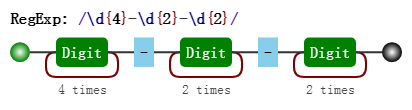

然后再修改成括号版的：

```js
var regex = /(\d{4})-(\d{2})-(\d{2})/;
```

其可视化形式是：

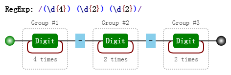

对比这两个可视化图片，我们发现，与前者相比，后者多了分组编号，如 Group #1。

其实正则引擎也是这么做的，在匹配过程中，给每一个分组都开辟一个空间，用来存储每一个分组匹配到的

数据。

既然分组可以捕获数据，那么我们就可以使用它们。

#### 3.2.1 提取数据

比如提取出年、月、日，可以这么做：

```js
var regex = /(\d{4})-(\d{2})-(\d{2})/;

var string = "2017-06-12";

console.log( string.match(regex) );

// => ["2017-06-12", "2017", "06", "12", index: 0, input: "2017-06-12"]
```

> `match `返回的一个数组，第一个元素是整体匹配结果，然后是各个分组（括号里）匹配的内容，然后是匹配下标，最后是输入的文本。另外，正则表达式是否有修饰符 `g`，`match`返回的数组格式是不一样的。

另外也可以使用正则实例对象的` exec`方法：

```js
var regex = /(\d{4})-(\d{2})-(\d{2})/;

var string = "2017-06-12";

console.log( regex.exec(string) );

// => ["2017-06-12", "2017", "06", "12", index: 0, input: "2017-06-12"]
```

同时，也可以使用构造函数的全局属性` $1 `至` $9` 来获取：

```js
var regex = /(\d{4})-(\d{2})-(\d{2})/;

var string = "2017-06-12";

regex.test(string); // 正则操作即可，例如

//regex.exec(string);

//string.match(regex);

console.log(RegExp.$1); // "2017"

console.log(RegExp.$2); // "06"

console.log(RegExp.$3); // "12"
```

#### 3.2.2. 替换

比如，想把` yyyy-mm-dd` 格式，替换成` mm/dd/yyyy` 怎么做？

```js
var regex = /(\d{4})-(\d{2})-(\d{2})/;

var string = "2017-06-12";

var result = string.replace(regex, "$2/$3/$1");

console.log(result);

// => "06/12/2017"
```

其中 replace 中的，第二个参数里用 $1、$2、$3 指代相应的分组。等价于如下的形式：

```js
var regex = /(\d{4})-(\d{2})-(\d{2})/;

var string = "2017-06-12";

var result = string.replace(regex, function () {

return RegExp.$2 + "/" + RegExp.$3 + "/" + RegExp.$1;

});

console.log(result);

// => "06/12/2017"
```

也等价于：

```js
var regex = /(\d{4})-(\d{2})-(\d{2})/;

var string = "2017-06-12";

var result = string.replace(regex, function (match, year, month, day) {

return month + "/" + day + "/" + year;

});

console.log(result);

// => "06/12/2017"
```

### 3.3 反向引用

除了使用相应 API 来引用分组，也可以在正则本身里引用分组。但只能引用之前出现的分组，即反向引用。

还是以日期为例。

比如要写一个正则支持匹配如下三种格式：

```
2016-06-12

2016/06/12

2016.06.12
```

最先可能想到的正则是:

最先可能想到的正则是:

```js
var regex = /\d{4}(-|\/|\.)\d{2}(-|\/|\.)\d{2}/;

var string1 = "2017-06-12";

var string2 = "2017/06/12";

var string3 = "2017.06.12";

var string4 = "2016-06/12";

console.log( regex.test(string1) ); // true

console.log( regex.test(string2) ); // true

console.log( regex.test(string3) ); // true

console.log( regex.test(string4) ); // true
```

其中 / 和 . 需要转义。虽然匹配了要求的情况，但也匹配` 2016-06/12`这样的数据。

假设我们想要求分割符前后一致怎么办？此时需要使用反向引用：

```js
var regex = /\d{4}(-|\/|\.)\d{2}\1\d{2}/;

var string1 = "2017-06-12";

var string2 = "2017/06/12";

var string3 = "2017.06.12";

var string4 = "2016-06/12";

console.log( regex.test(string1) ); // true

console.log( regex.test(string2) ); // true

console.log( regex.test(string3) ); // true

console.log( regex.test(string4) ); // false
```

其可视化形式是：

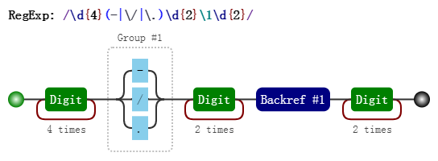

注意里面的` \1`，表示的引用之前的那个分组` (-|\/|\.)`。不管它匹配到什么（比如 -），`\1` 都匹配那个同

样的具体某个字符。

我们知道了` \1 `的含义后，那么 `\2 `和 `\3 `的概念也就理解了，即分别指代第二个和第三个分组。

看到这里，此时，恐怕你会有几个问题。

#### 3.3.1 括号嵌套怎么办？

以左括号（开括号）为准。比如：

```js
var regex = /^((\d)(\d(\d)))\1\2\3\4$/;

var string = "1231231233";

console.log( regex.test(string) ); // true

console.log( RegExp.$1 ); // 123

console.log( RegExp.$2 ); // 1

console.log( RegExp.$3 ); // 23

console.log( RegExp.$4 ); // 3
```

我们可以看看这个正则匹配模式：

• 第一个字符是数字，比如说` 1`，

• 第二个字符是数字，比如说` 2`，

• 第三个字符是数字，比如说 `3`，

• 接下来的是` \1`，是第一个分组内容，那么看第一个开括号对应的分组是什么，是 `123`，

• 接下来的是` \2`，找到第2个开括号，对应的分组，匹配的内容是 `1`，

• 接下来的是 `\3`，找到第3个开括号，对应的分组，匹配的内容是 `23`，

• 最后的是` \4`，找到第3个开括号，对应的分组，匹配的内容是 `3`。

此正则的可视化形式是：

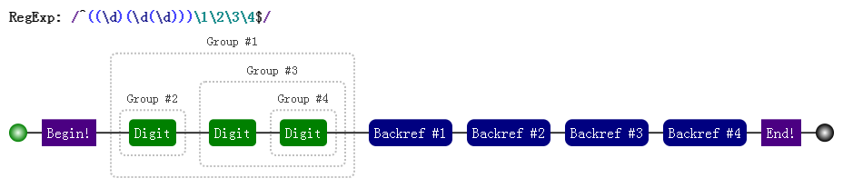

#### 3.3.2 \10 表示什么呢？

另外一个疑问可能是，即 \10 是表示第 10 个分组，还是 \1 和 0 呢？

答案是前者，虽然一个正则里出现 \10 比较罕见。测试如下：

```js
var regex = /(1)(2)(3)(4)(5)(6)(7)(8)(9)(#) \10+/;

var string = "123456789# ######"

console.log( regex.test(string) );

// => true
```

> 如果真要匹配 \1 和 0 的话，请使用 (?:\1)0 或者 \1(?:0)。

#### 3.3.3 引用不存在的分组会怎样？

因为反向引用，是引用前面的分组，但我们在正则里引用了不存在的分组时，此时正则不会报错，只是匹配

反向引用的字符本身。例如 \2，就匹配 "\2"。注意 "\2" 表示对 "2" 进行了转义。

```js
var regex = /\1\2\3\4\5\6\7\8\9/;

console.log( regex.test("\1\2\3\4\5\6\7\8\9") );

console.log( "\1\2\3\4\5\6\7\8\9".split("") );
// Chrome下

// => true
// => ['\x01', '\x02', '\x03', '\x04', '\x05', '\x06', '\x07', '8', '9']
```

> 不同的浏览器和版本，打印的结果可能不一样

#### 3.3.4 分组后面有量词会怎样？

分组后面有量词的话，分组最终捕获到的数据是最后一次的匹配。比如如下的测试案例：

```js
var regex = /(\d)+/;

var string = "12345";

console.log( string.match(regex) );

// => ["12345", "5", index: 0, input: "12345"]
```

从上面看出，分组 (\d) 捕获的数据是 "5"。

同理对于反向引用，也是这样的。测试如下：

```js
var regex = /(\d)+ \1/;

console.log( regex.test("12345 1") );

// => false

console.log( regex.test("12345 5") );

// => true
```

### 3.4 非捕获括号

之前文中出现的括号，都会捕获它们匹配到的数据，以便后续引用，因此也称它们是捕获型分组和捕获型分

支。

如果只想要括号最原始的功能，但不会引用它，即，既不在 API 里引用，也不在正则里反向引用。

此时可以使用非捕获括号 `(?:p)` 和 `(?:p1|p2|p3)`：

```js
var regex = /(?:ab)+/g;

var string = "ababa abbb ababab";

console.log( string.match(regex) );

// => ["abab", "ab", "ababab"]
```

```js
var regex = /^I love (?:JavaScript|Regular Expression)$/;

console.log( regex.test("I love JavaScript") );

console.log( regex.test("I love Regular Expression") );

// => true

// => true
```

## 四、回溯法原理

### 4.1 没有回溯的匹配

假设我们的正则是 `/ab{1,3}c/`，其可视化形式是：

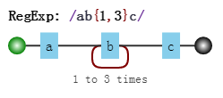

而当目标字符串是 `abbbc` 时，就没有所谓的“回溯”。其匹配过程是：

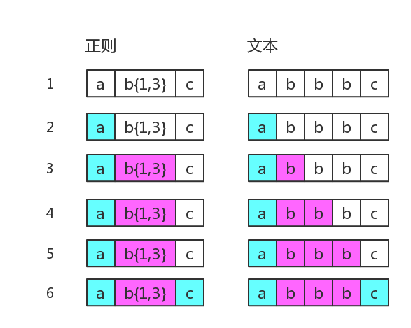

其中子表达式 `b{1,3} `表示` b`字符连续出现 1 到 3 次。

### 4.2 有回溯的匹配

如果目标字符串是`abbc`，中间就有回溯

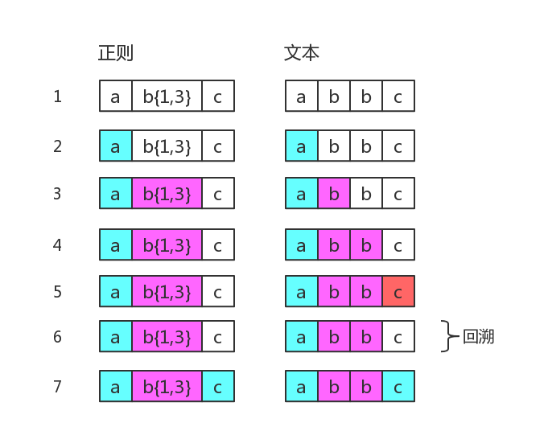

图中第 5 步有红颜色，表示匹配不成功。此时 `b{1,3}` 已经匹配到了 2 个字符 `b`，准备尝试第三个时，

结果发现接下来的字符是 `c`。那么就认为 `b{1,3}` 就已经匹配完毕。然后状态又回到之前的状态（即

第 6 步与第 4 步一样），最后再用子表达式` c`，去匹配字符` c`。当然，此时整个表达式匹配成功了。

图中的第 6 步，就是`回溯`。

再举一个例子。正则是：

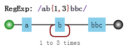

目标字符串是`abbbc`，匹配过程是：

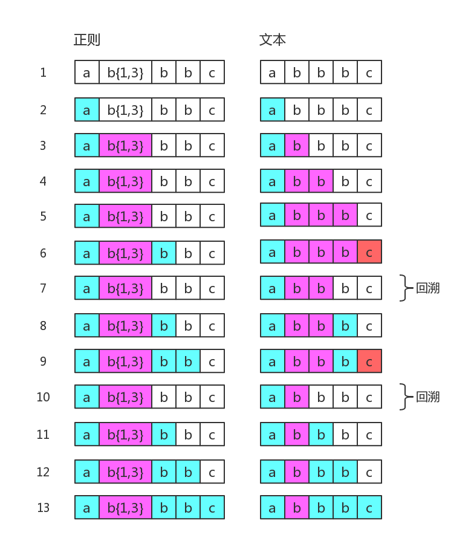

其中第 7 步和第 10 步是回溯。第 7 步与第 4 步一样，此时 `b{1,3}` 匹配了两个`b`，而第 10 步与

第 3 步一样，此时 `b{1,3}` 只匹配了一个 `b`，这也是 `b{1,3} `的最终匹配结果。

这里再看一个清晰的回溯，正则是：

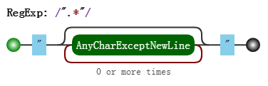

目标字符串是：`"abc"de`，匹配过程是：

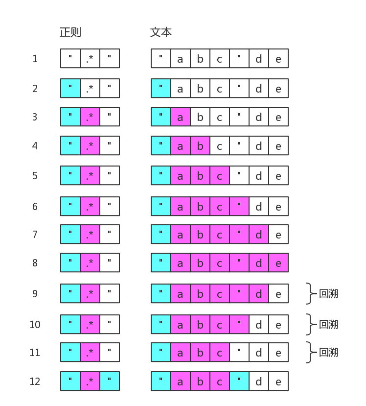

图中省略了尝试匹配双引号失败的过程。可以看出` .* `是非常影响效率的。

为了减少一些不必要的回溯，可以把正则修改为` /"[^"]*"/`。

### 4.3 常见的回溯形式

> 回溯法也称试探法，它的基本思想是：从问题的某一种状态（初始状态）出发，搜索从这种状态出发所能达到的所有“状态”，当一条路走到“尽头”的时候（不能再前进），再后退一步或若干步，从另一种可能“状态”出发，继续搜索，直到所有的“路径”（状态）都试探过。这种不断“前进”、不断“回溯”寻找解的方法，就称作“回溯法”。

本质上就是深度优先搜索算法。其中退到之前的某一步这一过程，我们称为“回溯”。从上面的描述过程中，可以看出，路走不通时，就会发生“回溯”。即，尝试匹配失败时，接下来的一步通常就是回溯。

#### 4.3.1 贪婪量词

之前的例子都是贪婪量词相关的。比如 `b{1,3}`，因为其是贪婪的，尝试可能的顺序是从多往少的方向去尝

试。首先会尝试 `bbb`，然后再看整个正则是否能匹配。不能匹配时，吐出一个 `b`，即在 `bb` 的基础

上，再继续尝试。如果还不行，再吐出一个，再试。如果还不行呢？只能说明匹配失败了。

虽然局部匹配是贪婪的，但也要满足整体能正确匹配。否则，皮之不存，毛将焉附？

此时我们不禁会问，如果当多个贪婪量词挨着存在，并相互有冲突时，此时会是怎样？

答案是，先下手为强！因为深度优先搜索。测试如下：

```js
var string = "12345";

var regex = /(\d{1,3})(\d{1,3})/;

console.log( string.match(regex) );

// => ["12345", "123", "45", index: 0, input: "12345"]
```

其中，前面的 `\d{1,3}` 匹配的是 `123`，后面的 `\d{1,3}` 匹配的是` 45`。

#### 4.3.2 惰性量词

惰性量词就是在贪婪量词后面加个问号。表示尽可能少的匹配，比如：

```
var string = "12345";

var regex = /(\d{1,3}?)(\d{1,3})/;

console.log( string.match(regex) );

// => ["1234", "1", "234", index: 0, input: "12345"]
```

其中` \d{1,3}? `只匹配到一个字符 `1`，而后面的 `\d{1,3}` 匹配了 `234`。

虽然惰性量词不贪，但也会有回溯的现象。比如正则是：

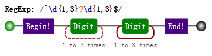

目标字符串是 `12345`，匹配过程是：

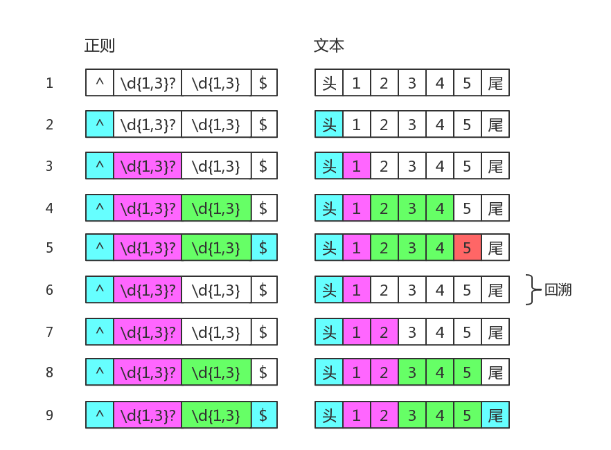

知道你不贪、很知足，但是为了整体匹配成，没办法，也只能给你多塞点了。因此最后` \d{1,3}?` 匹配的字符是 `12`，是两个数字，而不是一个。

#### 4.3.3 分支结构

我们知道分支也是惰性的，比如 `/can|candy/`，去匹配字符串 `candy`，得到的结果是` can`，因为分支会一个一个尝试，如果前面的满足了，后面就不会再试验了。

分支结构，可能前面的子模式会形成了局部匹配，如果接下来表达式整体不匹配时，仍会继续尝试剩下的分支。这种尝试也可以看成一种回溯。

比如正则：

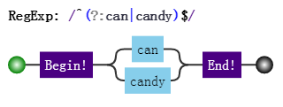

目标字符串是 `candy`，匹配过程：


上面第 5 步，虽然没有回到之前的状态，但仍然回到了分支结构，尝试下一种可能。所以，可以认为它是

一种回溯的。

### 4.4 本章小结

其实回溯法，很容易掌握的。

简单总结就是，正因为有多种可能，所以要一个一个试。直到，要么到某一步时，整体匹配成功了；要么最

后都试完后，发现整体匹配不成功。

• 贪婪量词“试”的策略是：买衣服砍价。价钱太高了，便宜点，不行，再便宜点。

• 惰性量词“试”的策略是：卖东西加价。给少了，再多给点行不，还有点少啊，再给点。

• 分支结构“试”的策略是：货比三家。这家不行，换一家吧，还不行，再换。

既然有回溯的过程，那么匹配效率肯定低一些

## 五、拆分

> 对于一门语言的掌握程度怎么样，可以有两个角度来衡量：读和写。
>
> 不仅要求自己能解决问题，还要看懂别人的解决方案。代码是这样，正则表达式也是这样。
>
> 正则这门语言跟其他语言有一点不同，它通常就是一大堆字符，而没有所谓“语句”的概念。
>
> 如何能正确地把一大串正则拆分成一块一块的，成为了破解“天书”的关键。

### 5.1 结构和操作符

编程语言一般都有操作符。只要有操作符，就会出现一个问题。当一大堆操作在一起时，先操作谁，又后操

作谁呢？为了不产生歧义，就需要语言本身定义好操作顺序，即所谓的优先级。

而在正则表达式中，操作符都体现在结构中，即由特殊字符和普通字符所代表的一个个特殊整体。

JavaScript 正则表达式中，都有哪些结构呢？

字符字面量、字符组、量词、锚、分组、选择分支、反向引用。

具体含义简要回顾如下：

| 结构   | 说明                                                         |
| ------ | ------------------------------------------------------------ |
| 字面量 | 匹配一个具体字符，包括不用转义的和需要转义的。比如 `a` 匹配字符 "a"，又比如` \n` 匹配换行符，<br />又比如`\. `匹配小数点。 |
| 字符组 | 匹配一个字符，可以是多种可能之一，比如` [0-9]`，表示匹配一个数字。<br />也有` \d` 的简写形式。<br />另外还有反义字符组，表示可以是除了特定字符之外任何一个字符，比如` [^0-9]`，<br />表示一个非数字字符，也有 `\D` 的简写形式。 |
| 量词   | 表示一个字符连续出现，比如 `a{1,3}` 表示 "a" 字符连续出现 3 次。<br />另外还有常见的简写形式，比如 `a+` 表示 "a" 字符连续出现至少一次。 |
| 锚     | 匹配一个位置，而不是字符。比如` ^ `匹配字符串的开头，又比如` \b` 匹配单词边界，<br />又比如` (?=\d) `表示数字前面的位置。 |
| 分组   | 用括号表示一个整体，比如 `(ab)+`，表示 "ab" 两个字符连续出现多次，<br />也可以使用非捕获分组` (?:ab)+`。 |
| 分支   | 多个子表达式多选一，比如` abc|bcd`，表达式匹配 "abc" 或者 "bcd" 字符子串。<br />反向引用，比如 `\2`，表示引用第 2 个分组。 |

其中涉及到的操作符有：

| 操作符描述     | 操作符                                   | 优先级 |
| -------------- | ---------------------------------------- | ------ |
| 转义符         | `\`                                      | 1      |
| 括号和方括号   | `(…)`、`(?:…)`、`(?=…)`、`(?!…)`、`[…] ` | 2      |
| 量词限定符     | `{m}`、`{m,n}`、`{m,}`、`?`、`*`、`+`    | 3      |
| 位置和序列     | `^`、`$`、`\元字符`、`一般字符`          | 4      |
| 管道符（竖杠） | `|`                                      | 5      |

上面操作符的优先级从上至下，由高到低。

这里，我们来分析一个正则：

`/ab?(c|de*)+|fg/`

• 由于括号的存在，所以，(c|de*) 是一个整体结构。

• 在 (c|de*) 中，注意其中的量词 ，因此 e 是一个整体结构。

• 又因为分支结构 | 优先级最低，因此 c 是一个整体、而 de* 是另一个整体。

• 同理，整个正则分成了 a、b?、(…)+、f、g。而由于分支的原因，又可以分成 ab?(c|de*)+ 和 fg 这两部分。

上面的分析可用其可视化形式描述如下：

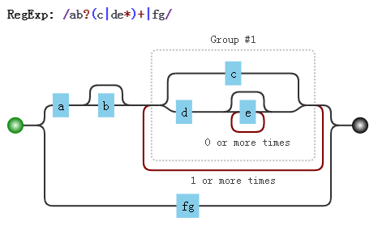

### 5.2 注意要点

关于结构和操作符，还是有几点需要强调：

#### 5.2.1 匹配字符串整体问题

因为是要匹配整个字符串，我们经常会在正则前后中加上锚 `^` 和` $`。

比如要匹配目标字符串 "abc" 或者 "bcd" 时，如果一不小心，就会写成` /^abc|bcd$/`。

而位置字符和字符序列优先级要比竖杠高，故其匹配的结构是：

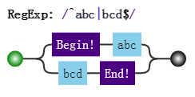

应该修改成:

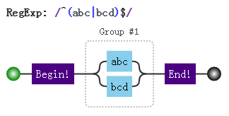

#### 5.2.2 量词连缀问题

假设，要匹配这样的字符串：

1. 每个字符为 "a、"b"、"c" 任选其一，
2. 字符串的长度是 3 的倍数。

此时正则不能想当然地写成` /^[abc]{3}+$/`，这样会报错，说 + 前面没什么可重复的：

```js
console.log(/^[abc]{3}+$/.test('abcabcabc'))

=> VM17114:1 Uncaught SyntaxError: Invalid regular expression: /^[abc]{3}+$/: Nothing to repeat
    at <anonymous>:1:9
```

此时要修改成：

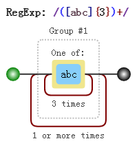

#### 5.2.3 元字符转义问题

所谓元字符，就是正则中有特殊含义的字符。

所有结构里，用到的元字符总结如下：

`^`、`$`、`.`、`*`、`+`、`?`、`|`、`\`、`/`、`(`、`)`、`[`、`]`、`{`、`}`、`=`、`!`、`:`、`- `,

当匹配上面的字符本身时，可以一律转义：

```js
var string = "^$.*+?|\\/[]{}=!:-,";

var regex = /\^\$\.\*\+\?\|\\\/\[\]\{\}\=\!\:\-\,/;

console.log( regex.test(string) );

// => true
```

其中 string 中的 \ 字符也要转义的。

另外，在 string 中，也可以把每个字符转义，当然，转义后的结果仍是本身：

```js
var string = "^$.*+?|\\/[]{}=!:-,";

var string2 = "\^\$\.\*\+\?\|\\\/\[\]\{\}\=\!\:\-\,";

console.log( string == string2 );

// => true
```

现在的问题是，是不是每个字符都需要转义呢？否，看情况。

##### 5.2.3.1 字符组中的元字符

跟字符组相关的元字符有` [`、`]`、`^`、`-`。因此在会引起歧义的地方进行转义。例如开头的 `^` 必须转义，不然

会把整个字符组，看成反义字符组。

```js
var string = "^$.*+?|\\/[]{}=!:-,";

var regex = /[\^$.*+?|\\/\[\]{}=!:\-,]/g;
 
console.log( string.match(regex) );

// => ["^", "$", ".", "*", "+", "?", "|", "\", "/", "[", "]", "{", "}", "=", "!", ":", "-", ","]
```

##### 5.2.3.2 匹配 "[abc]" 和 "{3,5}"

我们知道` [abc]`，是个字符组。如果要匹配字符串 "[abc]" 时，该怎么办？

可以写成` /\[abc\]/`，也可以写成 `/\[abc]/`，测试如下：

```js
var string = "[abc]";

var regex = /\[abc]/g;

console.log( string.match(regex)[0] );

// => "[abc]"
```

只需要在第一个方括号转义即可，因为后面的方括号构不成字符组，正则不会引发歧义，自然不需要转义。

同理，要匹配字符串 `"{3,5}"`，只需要把正则写成 `/\{3,5}/ `即可。

另外，我们知道量词有简写形式 `{m,}`，却没有 `{,n} `的情况。虽然后者不构成量词的形式，但此时并不会报错。当然，匹配的字符串也是` "{,n}"`，测试如下：

```js
var string = "{,3}";

var regex = /{,3}/g;

console.log( string.match(regex)[0] );

// => "{,3}"
```

##### 5.2.3.3 其余情况

比如 `=`、`!`、`:`、`-`、`,` 等符号，只要不在特殊结构中，并不需要转义。

但是，括号需要前后都转义的，如 `/\(123\)/`。

至于剩下的 `^`、`$`、`.`、`*`、`+`、`?`、`|`、`\`、`/ `等字符，只要不在字符组内，都需要转义的。

## 六、构建

> 对正则的运用，首重就是：如何针对问题，构建一个合适的正则表达式？

## 6.1 平衡法则

构建正则有一点非常重要，需要做到下面几点的平衡：

• 匹配预期的字符串

• 不匹配非预期的字符串

• 可读性和可维护性

• 效率

### 6.2. 构建正则前提

#### 6.2.1 是否能使用正则？

正则太强大了，以至于我们随便遇到一个操作字符串问题时，都会下意识地去想，用正则该怎么做。但我们

始终要提醒自己，正则虽然强大，但不是万能的，很多看似很简单的事情，还是做不到的。

比如匹配这样的字符串：1010010001…。

虽然很有规律，但是只靠正则就是无能为力。

#### 6.2.2 是否有必要使用正则？

要认识到正则的局限，不要去研究根本无法完成的任务。同时，也不能走入另一个极端：无所不用正则。能

用字符串 API 解决的简单问题，就不该正则出马。

比如，从日期中提取出年月日，虽然可以使用正则：

```js
var string = "2017-07-01";

var regex = /^(\d{4})-(\d{2})-(\d{2})/;

console.log( string.match(regex) );

// => ["2017-07-01", "2017", "07", "01", index: 0, input: "2017-07-01"]
```

其实，可以使用字符串的 split 方法来做，即可：

```js
var string = "2017-07-01";

var result = string.split("-");

console.log( result );

// => ["2017", "07", "01"]
```

比如，判断是否有问号，虽然可以使用：

```js
var string = "?id=xx&act=search";

console.log( string.search(/\?/) );

// => 0
```

其实，可以使用字符串的 indexOf 方法：

```js
var string = "?id=xx&act=search";

console.log( string.indexOf("?") );

// => 0
```

比如获取子串，虽然可以使用正则：

```js
var string = "JavaScript";

console.log( string.match(/.{4}(.+)/)[1] );

// => Script
```

其实，可以直接使用字符串的 substring 或 substr 方法来做：

```js
var string = "JavaScript";

console.log( string.substring(4) );

// => Script
```

#### 6.2.3. 是否有必要构建一个复杂的正则？

比如密码匹配问题，要求密码长度 6-12 位，由数字、小写字符和大写字母组成，但必须至少包括 2 种字符。

/(?!^[0-9]{6,12}$)(?!^[a-z]{6,12}$)(?!^[A-Z]{6,12}$)^[0-9A-Za-z]{6,12}$/

其实可以使用多个小正则来做：

```js
var regex1 = /^[0-9A-Za-z]{6,12}$/;

var regex2 = /^[0-9]{6,12}$/;

var regex3 = /^[A-Z]{6,12}$/;

var regex4 = /^[a-z]{6,12}$/;

function checkPassword (string) {

    if (!regex1.test(string)) return false;

    if (regex2.test(string)) return false;

    if (regex3.test(string)) return false;

    if (regex4.test(string)) return false;

    return true;

}
```

### 6.3. 准确性

所谓准确性，就是能匹配预期的目标，并且不匹配非预期的目标。

这里提到了“预期”二字，那么我们就需要知道目标的组成规则。

不然没法界定什么样的目标字符串是符合预期的，什么样的又不是符合预期的。

下面将举例说明，当目标字符串构成比较复杂时，该如何构建正则，并考虑到哪些平衡。

#### 6.3.1. 匹配固定电话

比如要匹配如下格式的固定电话号码：

```
055188888888

0551-88888888

(0551)88888888
```

第一步，了解各部分的模式规则。

上面的电话，总体上分为区号和号码两部分（不考虑分机号和 "+86" 的情形）。

区号是 "0" 开头的 3 到 4 位数字，对应的正则是：`0\d{2,3}`，

号码是非 "0" 开头的 7 到 8 位数字，对应的正则是：`[1-9]\d{6,7}`，

因此，匹配 "055188888888" 的正则是：`/^0\d{2,3}[1-9]\d{6,7}$/`，

匹配 "0551-88888888" 的正则是：`/^0\d{2,3}-[1-9]\d{6,7}$/`，

匹配 "(0551)88888888" 的正则是：/^\(0\d{2,3}\)[1-9]\d{6,7}$/。

第二步，明确形式关系。

这三者情形是或的关系，可以构建分支：

`/^0\d{2,3}[1-9]\d{6,7}$|^0\d{2,3}-[1-9]\d{6,7}$|^\(0\d{2,3}\)[1-9]\d{6,7}$/`

提取公共部分：

`/^(0\d{2,3}|0\d{2,3}-|\(0\d{2,3}\))[1-9]\d{6,7}$/`

进一步简写：

`/^(0\d{2,3}-?|\(0\d{2,3}\))[1-9]\d{6,7}$/`

其可视化形式：

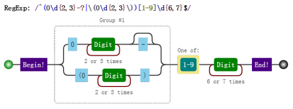

上面的正则构建过程略显罗嗦，但是这样做，能保证正则是准确的。

上述三种情形是或的关系，这一点很重要，不然很容易按字符是否出现的情形把正则写成：

`/^\(?0\d{2,3}\)?-?[1-9]\d{6,7}$/`

虽然也能匹配上述目标字符串，但也会匹配 "(0551-88888888" 这样的字符串。当然，这不是我们想要的。

其实这个正则也不是完美的，因为现实中，并不是每个 3 位数和 4 位数都是一个真实的区号。

这就是一个平衡取舍问题，一般够用就行。

#### 6.3.2. 匹配浮点数

要求匹配如下的格式：

```
1.23、+1.23、-1.23

10、+10、-10

.2、+.2、-.2
```

可以看出正则分为三部分。

符号部分：`[+-]`，

整数部分：`\d+`，

小数部分：`\.\d+`。

上述三个部分，并不是全部都出现。如果此时很容易写出如下的正则：

`/^[+-]?(\d+)?(\.\d+)?$/`

此正则看似没问题，但这个正则也会匹配空字符 ""。

因为目标字符串的形式关系不是要求每部分都是可选的。

要匹配 "1.23"、"+1.23"、"-1.23"，可以用`/^[+-]?\d+\.\d+$/`，

要匹配 "10"、"+10"、"-10"，可以用`/^[+-]?\d+$/`，

要匹配 ".2"、"+.2"、"-.2"，可以用`/^[+-]?\.\d+$/`。

因此整个正则是这三者的或的关系，提取公众部分后是：

`/^[+-]?(\d+\.\d+|\d+|\.\d+)$/`

其可视化形式是：

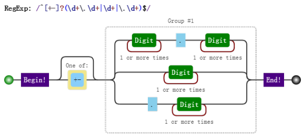

如果要求不匹配 "+.2" 和 "-.2"，此时正则变成：

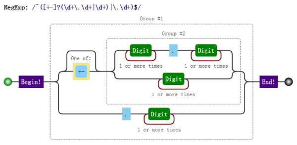

当然，`/^[+-]?(\d+\.\d+|\d+|\.\d+)$/` 也不是完美的，我们也是做了些取舍，比如：

它也会匹配 "012" 这样以 "0" 开头的整数。如果要求不匹配的话，需要修改整数部分的正则。一般进行验

证操作之前，都要经过` trim` 和`判空`。那样的话，也许那个错误正则也就够用了。也可以进一步改写成：

`/^[+-]?(\d+)?(\.)?\d+$/`，这样我们就需要考虑可读性和可维护性了。

### 6.4. 效率

保证了准确性后，才需要是否要考虑要优化。大多数情形是不需要优化的，除非运行的非常慢。什么情形正

则表达式运行才慢呢？我们需要考察正则表达式的运行过程（原理）。

正则表达式的运行分为如下的阶段：

• 1. 编译；

• 2. 设定起始位置；

• 3. 尝试匹配；

• 4. 匹配失败的话，从下一位开始继续第 3 步；

• 5. 最终结果：匹配成功或失败。

下面以代码为例，来看看这几个阶段都做了什么：

```js
var regex = /\d+/g;

console.log( regex.lastIndex, regex.exec("123abc34def") );

console.log( regex.lastIndex, regex.exec("123abc34def") );

console.log( regex.lastIndex, regex.exec("123abc34def") );

console.log( regex.lastIndex, regex.exec("123abc34def") );

// => 0 ["123", index: 0, input: "123abc34def"]

// => 3 ["34", index: 6, input: "123abc34def"]

// => 8 null

// => 0 ["123", index: 0, input: "123abc34def"]
```

具体分析如下：

```js
var regex = /\d+/g;
```

当生成一个正则时，引擎会对其进行编译。报错与否出现这这个阶段。

```js
regex.exec("123abc34def")
```

当尝试匹配时，需要确定从哪一位置开始匹配。一般情形都是字符串的开头，即第 `0 `位。

但当使用 `test` 和 `exec` 方法，且正则有 `g `时，起始位置是从正则对象的 `lastIndex `属性开始。

因此第一次 `exec` 是从第 0 位开始，而第二次是从 3 开始的。

设定好起始位置后，就开始尝试匹配了。

比如第一次 `exec`，从0开始，去尝试匹配，并且成功地匹配到 3 个数字。此时结束时的下标是 2，因此下

一次的起始位置是 3。

而第二次，起始下标是 3，但第 3 个字符是 "a"，并不是数字。但此时并不会直接报匹配失败，而是移动到

下一位置，即从第 4 位开始继续尝试匹配，但该字符是 "b"，也不是数字。再移动到下一位，是 "c" 仍不

行，再移动一位是数字 "3"，此时匹配到了两位数字 "34"。此时，下一次匹配的位置是 "d" 的位置，即第

8 位。

第三次，是从第 8 位开始匹配，直到试到最后一位，也没发现匹配的，因此匹配失败，返回 null。同时设

置 lastIndex 为 0，即，如要再尝试匹配的话，需从头开始。

从上面可以看出，匹配会出现效率问题，主要出现在上面的第 3 阶段和第 4 阶段。

因此，主要优化手法也是针对这两阶段的。

#### 6.4.1 使用具体型字符组来代替通配符，来消除回溯

而在第三阶段，最大的问题就是回溯。

例如，匹配双引用号之间的字符。如，匹配字符串 123"abc"456 中的 "abc"。

如果正则用的是：`/".*"/`，会在第 3 阶段产生 4 次回溯（粉色表示 `.* `匹配的内容）：

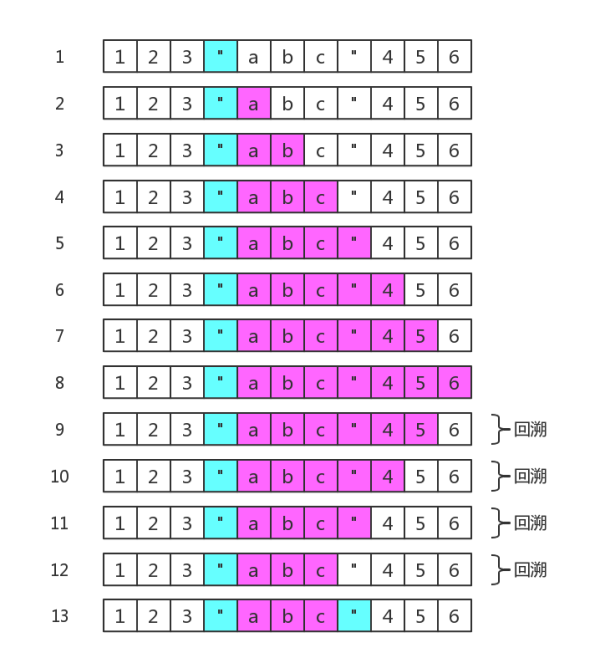

如果正则用的是：`/".*?"/`，会产生 2 次回溯（粉色表示` .*? `匹配的内容）：

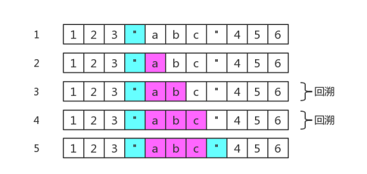

因为回溯的存在，需要引擎保存多种可能中未尝试过的状态，以便后续回溯时使用。注定要占用一定的内存。

此时要使用具体化的字符组，来代替通配符.，以便消除不必要的字符，此时使用正则 `/"[^"]*"/`，即可。

#### 6.4.2 使用非捕获型分组

因为括号的作用之一是，可以捕获分组和分支里的数据。那么就需要内存来保存它们。

当我们不需要使用分组引用和反向引用时，此时可以使用非捕获分组。

例如，`/^[-]?(\d\.\d+|\d+|\.\d+)$/ `可以修改成：`/^[-]?(?:\d\.\d+|\d+|\.\d+)$/`。

#### 6.4.3 独立出确定字符

例如，`/a+/ `可以修改成 `/aa*/`。

因为后者能比前者多确定了字符 "a"。这样会在第四步中，加快判断是否匹配失败，进而加快移位的速度。

#### 6.4.4 提取分支公共部分

比如，`/^abc|^def/ `修改成 `/^(?:abc|def)/`。

又比如， `/this|that/`修改成 `/th(?:is|at)/`。

这样做，可以减少匹配过程中可消除的重复。

#### 6.4.5. 减少分支的数量，缩小它们的范围

`/red|read/` 可以修改成 `/rea?d/`。

此时分支和量词产生的回溯的成本是不一样的。但这样优化后，可读性会降低的。

## 七、编程

### 7.1 正则表达式的四种操作

正则表达式是匹配模式，不管如何使用正则表达式，万变不离其宗，都需要先“匹配”。

有了匹配这一基本操作后，才有其他的操作：验证、切分、提取、替换。

进行任何相关操作，也需要宿主引擎相关 API 的配合使用。当然，在 JavaScript 中，相关 API 也不多。

### 7.1.1 验证

验证是正则表达式最直接的应用，比如表单验证。

在说验证之前，先要说清楚匹配是什么概念。

所谓匹配，就是看目标字符串里是否有满足匹配的子串。因此，“匹配”的本质就是“查找”。

有没有匹配，是不是匹配上，判断是否的操作，即称为“验证”。

这里举一个例子，来看看如何使用相关 API 进行验证操作的。

比如，判断一个字符串中是否有数字。

使用 `search`：

```js
var regex = /\d/;

var string = "abc123";

console.log( !!string.search(regex) );

// => true
```

使用 `test`：

```js
var regex = /\d/;

var string = "abc123";

console.log( regex.test(string) );

// => true
```

使用 `match`：

```js
var regex = /\d/;

var string = "abc123";

console.log( !!string.match(regex) );

// => true
```

使用 `exec`：

```js
var regex = /\d/;

var string = "abc123";

console.log( !!regex.exec(string) );

// => true
```

其中，最常用的是` test`。

#### 7.1.2 切分

匹配上了，我们就可以进行一些操作，比如切分。

所谓“切分”，就是把目标字符串，切成一段一段的。在 JavaScript 中使用的是 `split`。

比如，目标字符串是 "html,css,javascript"，按逗号来切分：

```js
var regex = /,/;

var string = "html,css,javascript";

console.log( string.split(regex) );

// => ["html", "css", "javascript"]
```

又比如，如下的日期格式：

```
2017/06/26

2017.06.26

2017-06-26
```

可以使用 `split` “切出”年月日：

```js
var regex = /\D/;

console.log( "2017/06/26".split(regex) );

console.log( "2017.06.26".split(regex) );

console.log( "2017-06-26".split(regex) );

// => ["2017", "06", "26"]

// => ["2017", "06", "26"]

// => ["2017", "06", "26"]
```

#### 7.1.3 提取

虽然整体匹配上了，但有时需要提取部分匹配的数据。

此时正则通常要使用分组引用（分组捕获）功能，还需要配合使用相关 API。

这里，还是以日期为例，提取出年月日。注意下面正则中的括号：

使用 `match`：

```js
var regex = /^(\d{4})\D(\d{2})\D(\d{2})$/;

var string = "2017-06-26";

console.log( string.match(regex) );

// =>["2017-06-26", "2017", "06", "26", index: 0, input: "2017-06-26"]
```

使用 `exec`：

```js
var regex = /^(\d{4})\D(\d{2})\D(\d{2})$/;

var string = "2017-06-26";

console.log( regex.exec(string) );

// =>["2017-06-26", "2017", "06", "26", index: 0, input: "2017-06-26"]
```

使用 `test`：

```js
var regex = /^(\d{4})\D(\d{2})\D(\d{2})$/;

var string = "2017-06-26";

regex.test(string);

console.log( RegExp.$1, RegExp.$2, RegExp.$3 );

// => "2017" "06" "26"
```

使用 `search`：

```js
var regex = /^(\d{4})\D(\d{2})\D(\d{2})$/;

var string = "2017-06-26";

string.search(regex);

console.log( RegExp.$1, RegExp.$2, RegExp.$3 );

// => "2017" "06" "26"
```

使用 `replace`：

```js
var regex = /^(\d{4})\D(\d{2})\D(\d{2})$/;

var string = "2017-06-26";

var date = [];

string.replace(regex, function (match, year, month, day) {

	date.push(year, month, day);

});
console.log(date);

// => ["2017", "06", "26"]
```

其中，最常用的是 `match`。

#### 7.1.4 替换

找，往往不是目的，通常下一步是为了替换。在 JavaScript 中，使用`replace` 进行替换。

比如把日期格式，从 `yyyy-mm-dd` 替换成 `yyyy/mm/dd`：

```js
var string = "2017-06-26";

var today = new Date( string.replace(/-/g, "/") );

console.log( today );

// => Mon Jun 26 2017 00:00:00 GMT+0800 (中国标准时间)
```

### 7.2 相关 API 注意要点

#### 7.2.1 search 和 match 的参数问题

我们知道字符串实例的那 4 个方法参数都支持正则和字符串。

但 `search` 和 `match`，会把字符串转换为正则的。

```js
var string = "2017.06.27";

console.log( string.search(".") );

// => 0

//需要修改成下列形式之一

console.log( string.search("\\.") );

console.log( string.search(/\./) );

// => 4

// => 4

console.log( string.match(".") );

// => ["2", index: 0, input: "2017.06.27"]

//需要修改成下列形式之一

console.log( string.match("\\.") );

console.log( string.match(/\./) );

// => [".", index: 4, input: "2017.06.27"]

// => [".", index: 4, input: "2017.06.27"]

console.log( string.split(".") );

// => ["2017", "06", "27"]

console.log( string.replace(".", "/") );

// => "2017/06.27"
```

#### 7.2.2 match 返回结果的格式问题

`match` 返回结果的格式，与正则对象是否有修饰符 `g` 有关。

```js
var string = "2017.06.27";

var regex1 = /\b(\d+)\b/;

var regex2 = /\b(\d+)\b/g;

console.log( string.match(regex1) );

console.log( string.match(regex2) );

// => ["2017", "2017", index: 0, input: "2017.06.27"]

// => ["2017", "06", "27"]
```

没有 `g`，返回的是标准匹配格式，即，数组的第一个元素是整体匹配的内容，接下来是分组捕获的内容，然

后是整体匹配的第一个下标，最后是输入的目标字符串。

有 `g`，返回的是所有匹配的内容。

当没有匹配时，不管有无` g`，都返回 `null`。

#### 7.2.3 exec 比 match 更强大

当正则没有 `g` 时，使用 `match` 返回的信息比较多。但是有 `g` 后，就没有关键的信息 `index` 了。

而 `exec` 方法就能解决这个问题，它能接着上一次匹配后继续匹配：

```js
var string = "2017.06.27";

var regex2 = /\b(\d+)\b/g;

console.log( regex2.exec(string) );

console.log( regex2.lastIndex);

console.log( regex2.exec(string) );

console.log( regex2.lastIndex);

console.log( regex2.exec(string) );

console.log( regex2.lastIndex);

console.log( regex2.exec(string) );

console.log( regex2.lastIndex);

// => ["2017", "2017", index: 0, input: "2017.06.27"]

// => 4

// => ["06", "06", index: 5, input: "2017.06.27"]

// => 7

// => ["27", "27", index: 8, input: "2017.06.27"]

// => 10

// => null

// => 0
```

其中正则实例 `lastIndex` 属性，表示下一次匹配开始的位置。

比如第一次匹配了 "2017"，开始下标是 0，共 4 个字符，因此这次匹配结束的位置是 3，下一次开始匹配

的位置是 4。

从上述代码看出，在使用 `exec` 时，经常需要配合使用 `while` 循环：

```js
var string = "2017.06.27";

var regex2 = /\b(\d+)\b/g;

var result;

while ( result = regex2.exec(string) ) {

	console.log( result, regex2.lastIndex );

}

// => ["2017", "2017", index: 0, input: "2017.06.27"] 4

// => ["06", "06", index: 5, input: "2017.06.27"] 7

// => ["27", "27", index: 8, input: "2017.06.27"] 10
```

#### 7.2.4 修饰符 g，对 exex 和 test 的影响

上面提到了正则实例的 `lastIndex` 属性，表示尝试匹配时，从字符串的 `lastIndex` 位开始去匹配。

字符串的四个方法，每次匹配时，都是从 0 开始的，即 lastIndex 属性始终不变。

而正则实例的两个方法 `exec`、`test`，当正则是全局匹配时，每一次匹配完成后，都会修改` lastIndex。`下面让我们以 `test` 为例：

```js
var regex = /a/g;

console.log( regex.test("a"), regex.lastIndex );

console.log( regex.test("aba"), regex.lastIndex );

console.log( regex.test("ababc"), regex.lastIndex );

// => true 1

// => true 3

// => false 0
```

注意上面代码中的第三次调用 `test`，因为这一次尝试匹配，开始从下标 `lastIndex`，即 3 位置处开始查

找，自然就找不到了。

如果没有 `g`，自然都是从字符串第 0 个字符处开始尝试匹配：

```js
var regex = /a/;

console.log( regex.test("a"), regex.lastIndex );

console.log( regex.test("aba"), regex.lastIndex );

console.log( regex.test("ababc"), regex.lastIndex );

// => true 0

// => true 0

// => true 0
```

#### 7.2.5 test 整体匹配时需要使用 ^ 和 $

这个相对容易理解，因为 `test` 是看目标字符串中是否有子串匹配正则，即有部分匹配即可。

如果，要整体匹配，正则前后需要添加开头和结尾：

```js
console.log( /123/.test("a123b") );

// => true

console.log( /^123$/.test("a123b") );

// => false

console.log( /^123$/.test("123") );

// => true
```

#### 7.2.6 split 相关注意事项

`split` 方法看起来不起眼，但要注意的地方有两个的。

第一，它可以有第二个参数，表示结果数组的最大长度：

```js
var string = "html,css,javascript";

console.log( string.split(/,/, 2) );

// =>["html", "css"]
```

第二，正则使用分组时，结果数组中是包含分隔符的：

```js
var string = "html,css,javascript";

console.log( string.split(/(,)/) );

// =>["html", ",", "css", ",", "javascript"]
```

#### 7.2.7 修饰符

ES5 中修饰符，共 3 个：

修饰符描述

| 修饰符 | 描述                                                         |
| ------ | ------------------------------------------------------------ |
| g      | 全局匹配，即找到所有匹配的，单词是 global。                  |
| i      | 忽略字母大小写，单词是 ingoreCase。                          |
| m      | 多行匹配，只影响 `^` 和 `$`，二者变成行的概念，即行开头和行结尾。单词是 `multiline`。 |

当然正则对象也有相应的只读属性：

```js
var regex = /\w/img;

console.log( regex.global );

console.log( regex.ignoreCase );

console.log( regex.multiline );

// => true

// => true

// => true
```

#### 7.2.8 使用构造函数需要注意的问题

一般不推荐使用构造函数生成正则，而应该优先使用字面量。因为用构造函数会多写很多` \`。

```js
var string = "2017-06-27 2017.06.27 2017/06/27";

var regex = /\d{4}(-|\.|\/)\d{2}\1\d{2}/g;

console.log( string.match(regex) );

// => ["2017-06-27", "2017.06.27", "2017/06/27"]

regex = new RegExp("\\d{4}(-|\\.|\\/)\\d{2}\\1\\d{2}", "g");

console.log( string.match(regex) );

// => ["2017-06-27", "2017.06.27", "2017/06/27"]
```

#### 7.2.10 构造函数属性

构造函数的静态属性基于所执行的最近一次正则操作而变化。除了是 $1,…,$9 之外，还有几个不太常用的属性（有兼容性问题）：

| 静态属性              | 描述                            | 简写形式       |
| --------------------- | ------------------------------- | -------------- |
| `RegExp.input `       | 最近一次目标字符串              | `RegExp["$_"]` |
| `RegExp.lastMatch`    | 最近一次匹配的文本              | `RegExp["$&"]` |
| `RegExp.lastParen`    | 最近一次捕获的文本              | `RegExp["$+"]` |
| `RegExp.leftContext`  | 目标字符串中lastMatch之前的文本 | `RegExp["$`"]` |
| `RegExp.rightContext` | 目标字符串中lastMatch之后的文本 | `RegExp["$'"]` |

测试代码如下：

```js
var regex = /([abc])(\d)/g;

var string = "a1b2c3d4e5";

string.match(regex);

console.log( RegExp.input );

console.log( RegExp["$_"]);

// => "a1b2c3d4e5"

console.log( RegExp.lastMatch );

console.log( RegExp["$&"] );

// => "c3"

console.log( RegExp.lastParen );

console.log( RegExp["$+"] );

// => "3"

console.log( RegExp.leftContext );

console.log( RegExp["$`"] );

// => "a1b2"

console.log( RegExp.rightContext );

console.log( RegExp["$'"] );

// => "d4e5"
```

